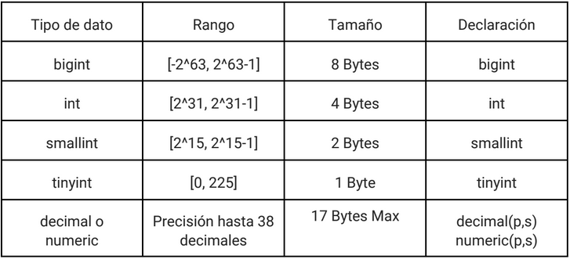
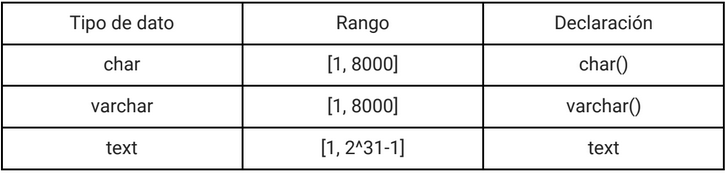
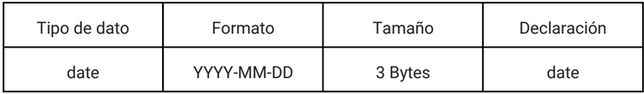

author: Erick Varela
summary: Guía de aprendizaje 01
id: g01
categories: Databases
environments: Databases
status: Published
feedback link: mailto:e

# Transact-SQL / T-SQL

## Introduccion a T-SQL

Transact-SQL, o como se suele abreviar, T-SQL, es un lenguaje de programacion diseñado para ser usado en el motor de bases de datos de microsoft SQL Server. Al ser considerado un lenguaje de programacion, este le da multiples herramientas similares a las de otros lenguajes de programacion. En esta guia se espera que el estudiante:

 - Uso de Sub-consultas para consultas de alta complejidad
 - Uso de bloques de programacion para el uso de variables y programacion dinamica
 - Uso de funciones y procedimientos almacenados para la estandarizacion de tareas
 - Uso de vistas para la reutilizacion de consultas comunes

## Sub-consultas

Las sub-consultas son consultas anidadas dentro de otras consultas productos de procesos:
    
 - INSERT
 - UPDATE
 - DELETE
 - SELECT

Las sub-consultas son regularmente utilizadas para la generacion de consultas dinamicas, es decir, consultas que, con el tiempo, pueden necesitar cambios, cambios que se actualizan gracias al uso de subconsultas, como el siguiente ejemplo:

 - Consulta sin usar sub-consultas, donde actualizamos una lista de empleados que cumplen cierta condicion

```sql
UPDATE EMPLEADO SET Estrella = 1 WHERE id = 17 OR id = 3 OR id = 20 OR id = 1
```

 - Consulta usando sub-consultas, donde las condiciones ahora son dinamicas y se actualizan a aquellos que cumplen la misma

```sql
UPDATE EMPLEADO SET Estrella = 1 WHERE id IN 
(SELECT E.id FROM Empleado E
INNER JOIN Proyecto P ON E.id = P.id_lider
GROUP BY E.id, E.nombre
HAVING SUM(P.Precio) > 700)
```

Algunos utilidades de las sub-consultas son las siguientes:

 1. Podemos usar SubQueries como que de una lista se tratasen, o un valor unico, para usarlas dentro de condionales
 2. Podemos usarlas como fuentes de datos dentro de otras consultas para usar los resultados de la SubQuery como una tabla
 3. Casos donde se necesiten dato/s de forma dinamica para sentencias de SELECT, UPDATE, INSERT y DELETE son problemas que se resuelve con SubQueries

Si el estudiante desea saber mas sobre sub-consultas, puede revisar
[la siguiente guia de trabajo](https://chriss6202.github.io/Codelabs/g05/g05/#0)

## Tipos de datos

Hay que tener en cuenta los tipos de datos que usaremos para cada campo, así que se listaran los más utilizados para tener algunas nociones:

Numericos:

 

Cadenas de texto:



Fecha:



## Bloque anonimo

Los bloques anónimos no tienen ningún nombre concreto, por eso de anónimos. Un bloque T-SQL es definido por las palabras clave DECLARE, BEGIN, EXCEPTION, y END, que dividen el bloque en tres secciones:

 - Declare: Se definen los distintos objetos que se van a utilizar en el bloque (variables, constantes, cursores, etcétera). Esta sección es opcional.

 - Begin: En esta zona estará el código T-SQL que ejecutaremos.

 - End: Indica el cierre del bloque anónimo.

Un bloque es en sí mismo una sentencia ejecutable, por lo que se pueden anidar los bloques unos dentro de otros.

Sintaxis:

```sql
DECLARE
    --Declaracion de variables
BEGIN
    --Tratamiento de excepciones
END;
```

## Variables en T-SQL

Variables: Las variables son nombres para procesar los elementos de los datos.

```sql
Nombre_variable tipo [NOT NULL] [:= valor | DEFAULT valor]
```

Al tener una tabla origen, podemos insertar los datos de dicha tabla a una nueva tabla destino. Se puede elegir ciertos campos de la tabla o bien se pueden insertar todos, teniendo en cuenta que ambas tienen que tener los mismos capos con su mismo tipo de dato.

```sql
INSERT INTO nombre_tabla SELECT * FROM nombre_tabla_fuente
```

## Estructuras de control

### IF/THEN/ELSE

Esta sentencia es utilizada cuando se quiere elegir entre dos opciones basadas en una condición.

```sql
IF condition THEN
    {-- Código a ejecutar si la condición es verdadera... }

ELSE
    {-- Código a ejecutar si la condición es false... }
END IF;
```

### WHILE

La instruccion WHILE, igual que sus homologos en otro lenguaje de programacion, permite entrar en bucles mientras se cumpla en una condicion

```sql
BEGIN
    DECLARE @a INT = 0, @b INT = 1, @tmp INT, @i INT = 1;
    WHILE @i < 10
    BEGIN
	    SELECT @tmp = @b, @b = @a + @b, @a = @tmp, @i = @i +1;
	    PRINT 'b = ' + CAST(@b AS VARCHAR);
    END
END
```

## Funciones y procedimientos almacenados

### Procedimientos almacenados

Un procedimiento almacenado, o stored procedure en inglés, es un conjunto de sentencias SQL, al cual se le asigna un nombre y se almacena como un objeto en el servidor de la base de datos, de manera que este pueda ser reutilizado y compartido con diferentes programas.

Al ejecutar un procedimiento por primera vez, SQL Server crea un plan de ejecución y lo guarda en el plan cache, de forma que en ejecuciones futuras se pueda reutilizar dicho plan y el procedimiento se realice muy rápido con rendimiento confiable.

Sintaxis:

```sql
CREATE [OR ALTER] PROCEDURE nombre_procedimiento
[
@aram1 datatype [, ...n]
]
AS
BEGIN
    sentencia_sql;
    [...n]
END
```

### Funciones

De forma similar a los procedimientos almacenados, las funciones son conjuntos de sentencias SQL que se almacenan como objetos en la base de datos que suelen encapsular procesos lógicos para su reutilización.

Sin embargo, la principal diferencia con los procedimientos almacenados es que es obligatorio que las funciones devuelvan un valor, al contrario de los procedimientos que pueden o no tener valores de retorno. Otras diferencias entre procedimientos y funciones son:

 - Las funciones pueden tener sólo parámetros de entrada, mientras que los procedimientos pueden tener de entrada y salida.
 - Las funciones pueden ser llamadas desde un procedimiento, pero no se puede llamar un procedimiento desde una función.
 - Las funciones escalares pueden usarse como campo en una consulta.
 - Sólo se permiten instrucciones de consulta, no es posible insertar, actualizar o eliminar datos de tablas.

#### Funciones Escalares

Las funciones escalares reciben varios parámetros y devuelven un único valor. 
Sintaxis:

```sql
CREATE [OR ALTER] FUNCTION dbo.[nombre_funcion] (
    @param1 datatype [, ...n]
)
RETURNS datatype
AS
BEGIN
    [sentencias sql]
    [... n]
    RETURN @varable_de_retorno
END
```

#### Funciones de Tabla

Este tipo de funciones brinda como valor de retorno una tabla generada dentro de la misma. Estas brindan la posibilidad de incluir estructuras de control como IF o WHILE. Pueden ser utilizadas en el FROM de una consulta y también en las sentencias JOIN.

Para ejemplo, se puede recrear el ejemplo hecho en la parte de Procedimientos, pero ahora como una función que devuelve una tabla.

```sql
CREATE FUNCTION lista()
RETURNS table
AS
    RETURN
    SELECT l.titulo Libro, p.fecha_prestamo 'Fecha de préstamo', p.fecha_devolucion 'Fecha de devolución', CONCAT(u.nombre, ' ', u.apellido) AS Cliente
    FROM PRESTAMO AS p
    INNER JOIN USUARIO AS u ON p.codigo_usuario = u.codigo
    INNER JOIN EJEMPLAR AS e ON e.codigo = p.codigo_ejemplar
    INNER JOIN LIBRO AS l ON l.codigo = e.codigo_libro;
```

## Trigger

Un Trigger se lleva a cabo cuando se produce algún suceso relacionado con la misma. Los triggers pueden utilizarse para completar la integridad referencial, también para imponer reglas de negocio complejas o para auditar cambios en los datos. El código contenido en un trigger denominado cuerpo del trigger, está formado por bloques T-SQL.

```sql
CREATE [ OR ALTER ] TRIGGER trigger_name
ON { table } {AFTER | INSTEAD OF}
{INSERT | UPDATE | DELETE}
AS
BEGIN
    --Cuerpo del trigger
END
```

## Créditos

Departamento de Electrónica e Informática, Universidad Centroamericana José Simeón Cañas, La Libertad, El Salvador.

**Versión de este documento:** Versión 5, 2025.

| **Versión**  | **Autores** |
|----------|----------|
| **1** | Ismael Chicas Garcia (00036818@uca.edu.sv), Oscar Rivas Borjas (00005218@uca.edu.sv), Erick Varela Guzmán (evarela@uca.edu.sv). |
| **2** | Josué Cortez (00402918@uca.edu.sv) |
| **3**  | Alejandro Ernesto Cerón Lemus (00040116@uca.edu.sv), Brian Darwin Carranza Campos (00136020@uca.edu.sv) |
| **4** | Claudia María Chávez Grande (00037221@uca.edu.sv)|
| **5** | Christian Alejandro Paz Escobar (00132720@uca.edu.sv) |

 This work is licensed under a [Creative Commons Attribution-NonCommercial-ShareAlike 4.0 International License](http://creativecommons.org/licenses/by-nc-sa/4.0/).