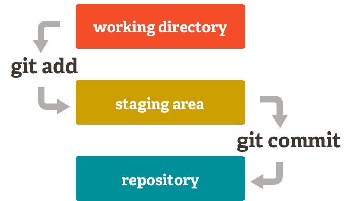

# Guía: cómo usar imágenes subidas al repositorio y usarlas en guías Markdown

Esta guía explica el flujo recomendado para **subir imágenes al repo** y **consumirlas en archivos `.md`** usando URLs directas (raw) de GitHub.

## Objetivo

* Mantener un **repositorio de imágenes organizado** (p. ej. por curso/módulo/guía).
* Insertar imágenes en guías Markdown de forma **estable y reproducible**.
* Evitar problemas de enlaces rotos.

## Estructura de carpetas sugerida

Ejemplo para un curso con guías:

```
PED/
  Guias/
    CP4.md
  Imagenes/
    CP4/
      A.png
      B.png
      diagrama-1.svg
```

> **Tip**: Usa una carpeta de imágenes por guía (o por módulo) para mantener orden.

## Obtener la URL RAW (directa) de una imagen

1. Abre el archivo de imagen en GitHub (vista del repositorio).
2. Clic en **Download** o **View raw** (según UI), que te lleva a `raw.githubusercontent.com`.
3. Copia la URL del navegador.

**Forma canónica de URL RAW**:

```
https://raw.githubusercontent.com/<owner>/<repo>/<branch>/<ruta/archivo>
```

Ejemplo (rama `main`):

```
https://raw.githubusercontent.com/meaguilar/meaguilar.github.io/main/PED/Imagenes/CP4/B.png
```

## Insertar imágenes en Markdown

### Con URL RAW

```md

```
* Nota: en **repos privados** los enlaces RAW no serán accesibles para lectores anónimos.

# Editar guías `.md` con StackEdit + cómo insertar imágenes

Esta sección documenta el flujo para **editar archivos Markdown** de las guías usando **StackEdit** y **consumir imágenes** (con URL RAW o rutas relativas) desde el mismo repositorio.

## Requisitos

* Tener acceso de escritura al repositorio en GitHub (p. ej. rama `main` o una rama de trabajo).
* Estructura de carpetas para imágenes definida (ver sección anterior).
* Navegador web y cuenta en **StackEdit** (puedes iniciar sesión con Google/GitHub).

## Flujo recomendado de edición con StackEdit

1. **Abrir StackEdit**

   * Ve a [https://stackedit.io/](https://stackedit.io/) y **Sign in**.

2. **Cargar el archivo a editar** (dos opciones):

   * **Desde GitHub (sincronizado)**

     1. En StackEdit, abre el **panel lateral** → **Synchronize** → **Add synchronization**.
     2. Elige **GitHub** y autoriza a StackEdit.
     3. Selecciona **Repository**, **Branch** y la **ruta del archivo** (p. ej. `PED/Guias/CP1.md`).
     4. Activa **Push on save** (si quieres que cada guardado haga commit) o haz **Manual push** al finalizar.
   * **Desde un archivo local / pegar contenido**

     * Crea un documento nuevo en StackEdit y pega el contenido; al terminar, **exporta** o **sincroniza** con GitHub creando la vinculación (recomendado para mantener historial de cambios).

3. **Editar el contenido**

   * Usa el **editor** a la izquierda y la **vista previa** a la derecha.
   * Mantén consistencia en **encabezados**, **tablas**, **listas**, **código** y **bloques con HTML inline** (para controlar tamaños de imagen, ver más abajo).

4. **Guardar y subir cambios**

   * Si configuraste sincronización con **Push on save**, al **Ctrl/Cmd+S** se hará commit al repo (StackEdit solicitará un mensaje).
   * Si no, usa **Synchronize → Push** cuando termines.
   * Verifica en GitHub que el archivo se actualizó en la **rama correcta**.

> **Sugerencia de ramas:** Trabaja en una **rama feature** (p. ej. `docs/cp1-actualizacion`) y luego abre un **Pull Request** para revisión antes de fusionar a `main`.

## “Click para ampliar” (miniatura enlazada a la imagen grande)

```md
[](../Imagenes/CP1/A.png)
```
