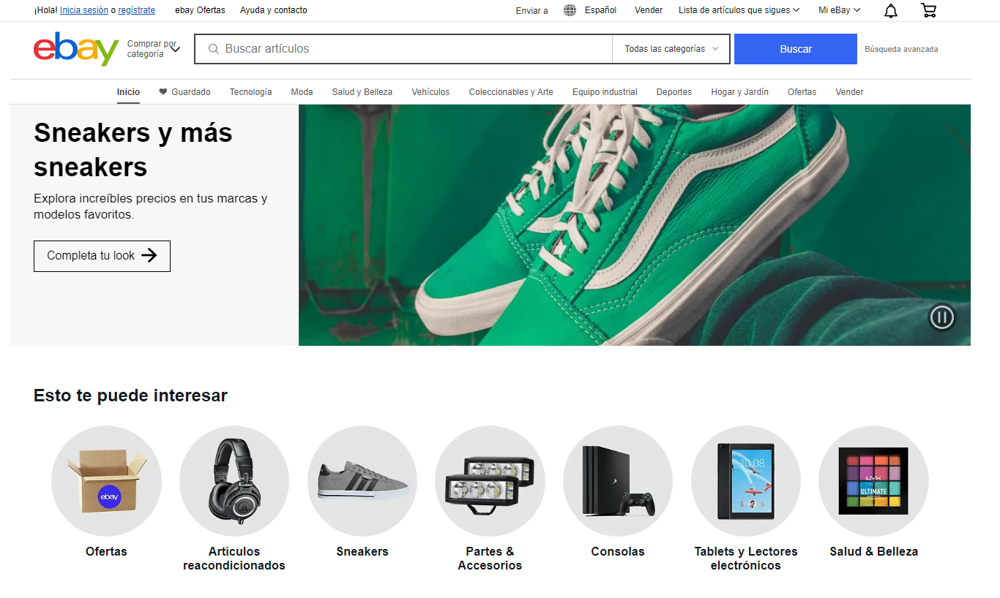

# Evaluación práctica: Corto Práctico 3 [CP3]

1. Crea una aplicación para escritorio en Rider en esta carpeta
2. Selecciona una GUI que deseas recrear, buscala en la web
3. Toma la captura de pantalla de esa GUI y colocala dentro del proyecto
3. Tu GUI debe contar  con los siguientes controles: 
    - label, botones, picture, textbox como minimo y todos los que consideres necesarios
4. Tu GUI debe contar  con el evento clic

> Importante: debes cambiar el nombre de cada uno de los controles que utilices, tomando en cuenta los prefijos estudiados en clases. 

## Criterios a evaluar

<table>
  <tr>
   <td>
<strong>Puntos a evaluar</strong>
   </td>
   <td><strong>Nota asignada</strong>
   </td>
  </tr>
  <tr>
   <td>Uso de controles
   </td>
   <td>20%
   </td>
  </tr>
  <tr>
   <td>Cambio propiedades (fuente, tamaño, color, icono, entre otros)
   </td>
   <td>20%
   </td>
  </tr>
  <tr>
   <td>Implementación de evento clic 
   </td>
   <td>20%
   </td>
  </tr>
  <tr>
   <td>Aplicación de buenas prácticas (nombre de controles, commit)
   </td>
   <td>20%
   </td>
  </tr>
  <tr>
   <td>Recreación completa de la GUI seleccionada 
   </td>
   <td>20%
   </td>
  </tr>
  <tr>
   <td>

<strong>Total</strong>

   </td>
   <td>100%
   </td>
  </tr>
</table>

## Ejemplo de GUI 

