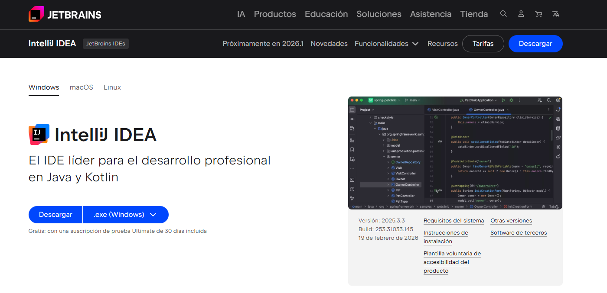
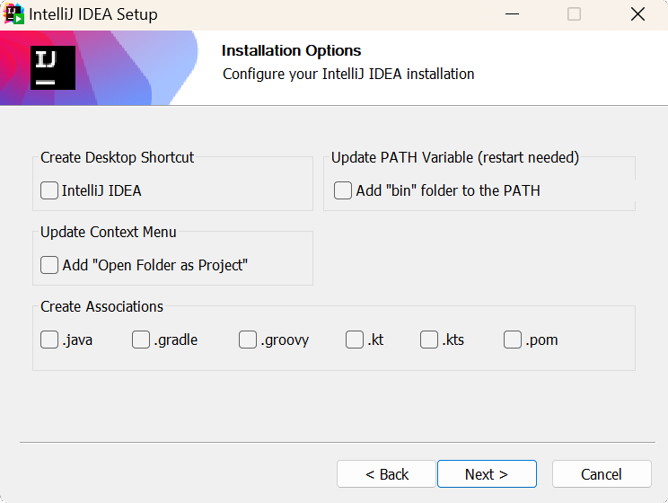
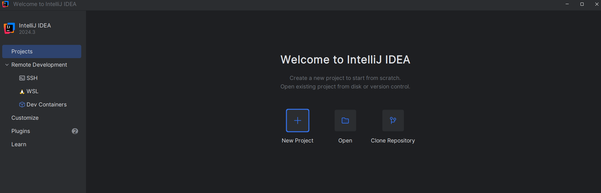
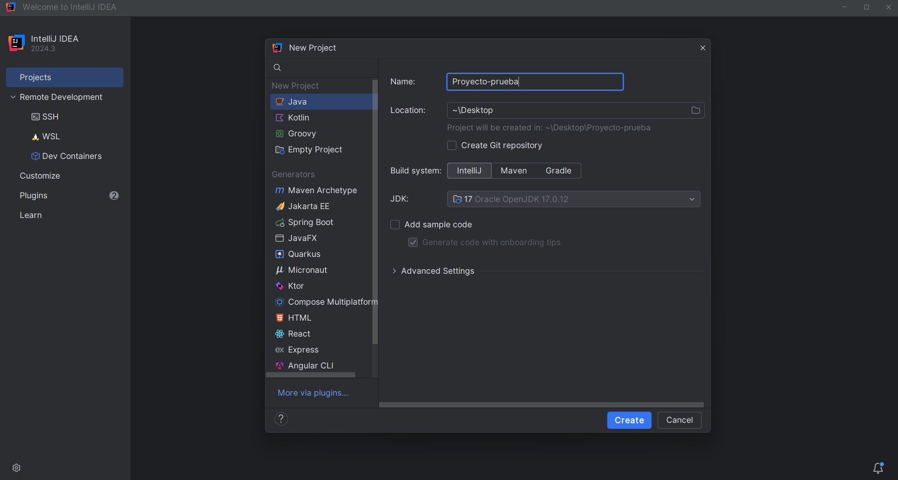
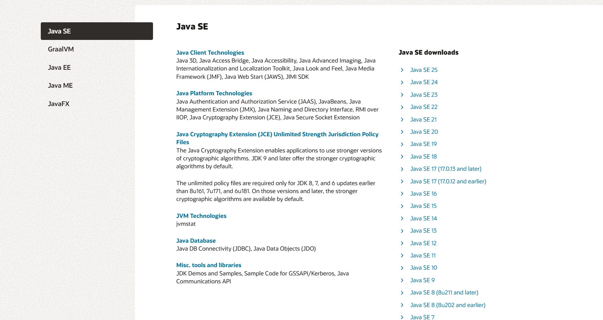
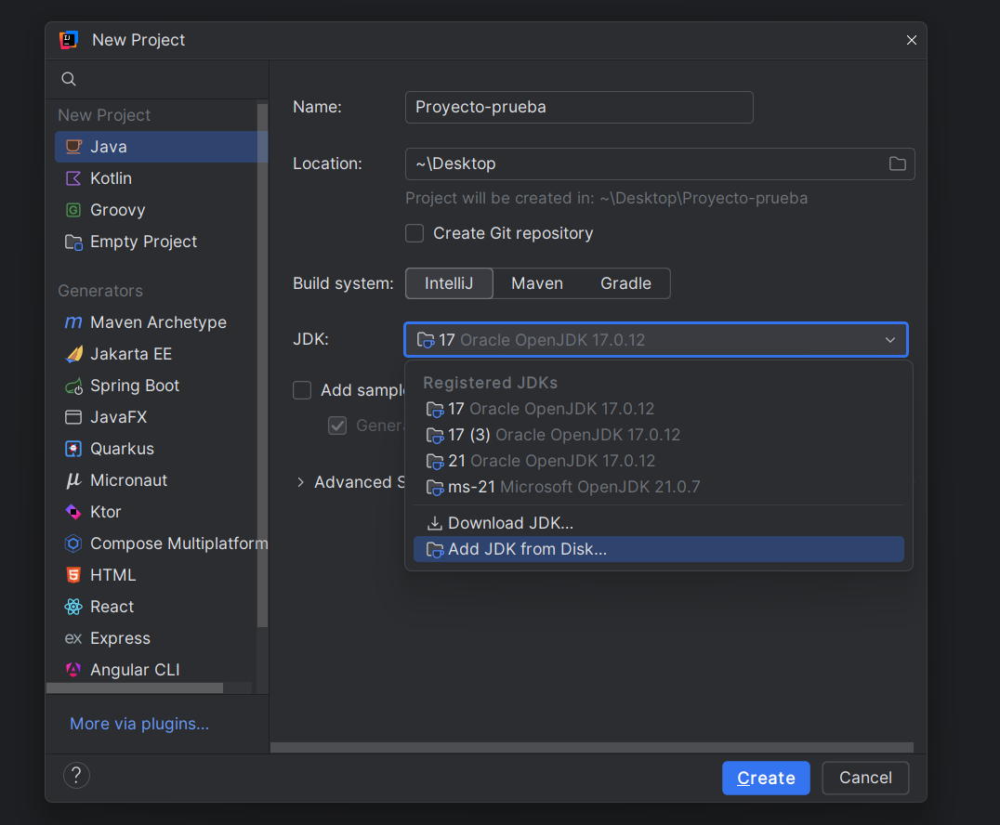
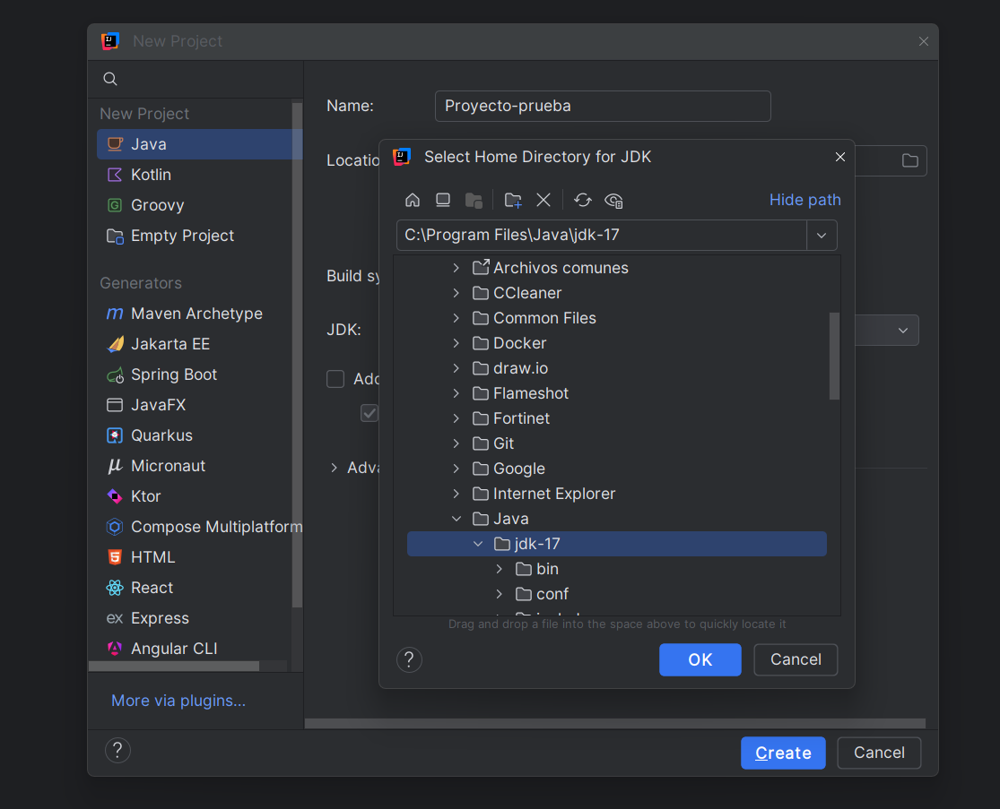
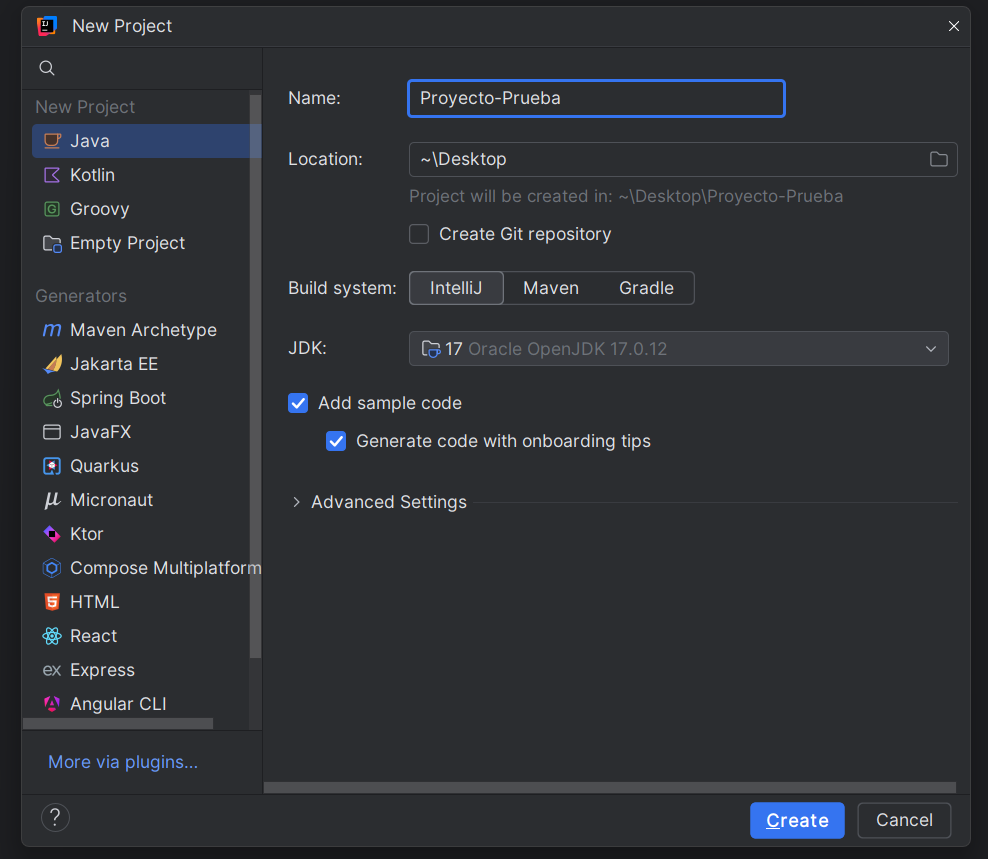
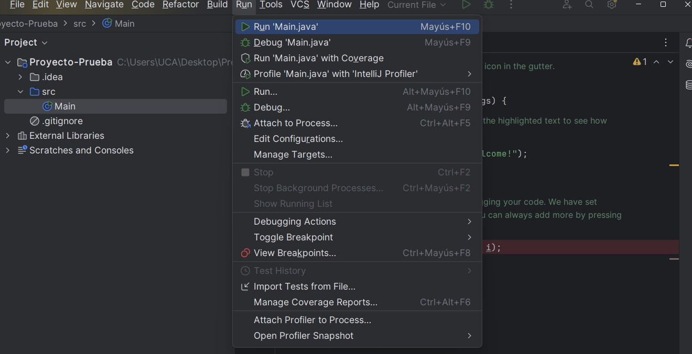
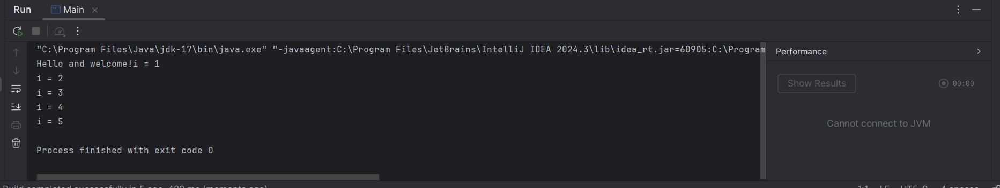

# Configuración del entorno de desarrollo para Java

1. Instalar IntelliJ IDEA (Entorno de Desarrollo Integrado).  
2. Configurar el JDK (Java Development Kit)

---

## Requisitos para instalar IntelliJ IDEA
| Requisito            | Mínimo                | Recomendado                                  |
|----------------------|----------------------|----------------------------------------------|
| **RAM**              | 2 GB de RAM          | 8 GB de RAM total del sistema                |
| **Espacio en disco** | 3,5 GB libres        | Unidad SSD con al menos 5 GB de espacio libre |

---

##  Descarga e Instalación de IntelliJ IDEA

### Paso 1: Descargar el instalador
Accede al sitio oficial de [JetBrains](https://www.jetbrains.com/es-es/idea/download/?section=windows). Una vez descargado, instala el programa según tu sistema operativo.



---

### Paso 2: Instalar IntelliJ IDEA

#### Windows
Ejecuta el archivo `.exe` y deja todas las opciones por defecto.

#### MacOS
Abre el archivo `.dmg` que descargaste y arrastra IntelliJ IDEA a la carpeta _Applications_.

#### Linux
Extrae el archivo `.tar.gz` en una carpeta de tu preferencia, abre una terminal, navega a dicha carpeta y ejecuta `./idea.sh`.

## Ejecute el instalador de IntelliJ IDEA y siga las instrucciones del asistente

Durante el paso **Opciones de instalación**, puede configurar lo siguiente según sus preferencias:

1. **Crear un acceso directo en el escritorio**  
   Para abrir IntelliJ IDEA rápidamente desde el escritorio.

2. **Agregar los lanzadores de línea de comandos a la variable PATH**  
   Esto le permitirá ejecutar los comandos de IntelliJ IDEA desde cualquier directorio en el símbolo del sistema o terminal.

3. **Agregar "Abrir carpeta como proyecto" al menú contextual**  
   Esta opción permite que, al hacer clic derecho sobre una carpeta, pueda abrirla directamente como proyecto en IntelliJ IDEA.

4. **Asociar extensiones de archivo con IntelliJ IDEA**  
   Los archivos con extensiones específicas se abrirán automáticamente con IntelliJ IDEA al hacer doble clic sobre ellos.



**Ejecutar IntelliJ IDEA:**  
Para abrir IntelliJ IDEA, búsquelo en el menú Inicio de Windows o use el acceso directo que se creó en el escritorio.

---

### Paso 3: Abrir IntelliJ y crear un nuevo proyecto

1. Abre IntelliJ IDEA desde el acceso directo o menú de aplicaciones.  
2. Si el IDE pregunta si deseas importar configuraciones previas, selecciona _Do not import settings_.  
3. Haz clic en _New Project_ en la pantalla de bienvenida.




---

### Paso 4: Configurar el JDK
El **JDK** (Java Development Kit) es un conjunto de herramientas esenciales para desarrollar y ejecutar aplicaciones Java. Incluye el compilador, la Máquina Virtual de Java (**JVM**) y bibliotecas necesarias. Para este curso, utilizaremos **JDK 17**, tiene soporte oficial hasta el año 2029, estable y moderna ó **JDK 21**.  

Para configurar el JDK en IntelliJ IDEA:
1. Crea un nuevo proyecto, asigna nombre y ubicación.  
2. En el panel izquierdo, selecciona _Java_.  
3. En _SDK_, verifica si hay algún JDK instalado.



Si no está instalado, IntelliJ IDEA puede descargarlo automáticamente. Alternativamente, descarga manualmente desde [Java Archive JDK](https://www.oracle.com/java/technologies/downloads/archive/) (**Java SE 17.0.12**).



Una vez instalado, regresa a IntelliJ y selecciona **Add JDK from disk**, buscando la carpeta de instalación del JDK (`C:/Program Files/Java/` por defecto).





---

### Paso 5: Finalizar creación de proyecto
Seleccionar la opción _Add sample code_, esto generará un ejemplo de prueba. Haz clic en _create_ para crear el proyecto. 



Ejecuta el botón _Run_ para comprobar que todo funciona


-- 
### Resultado final 


La consola debería mostrar:
```shell
Hello and welcome!
i = 1
i = 2
i = 3
i = 4
i = 5


