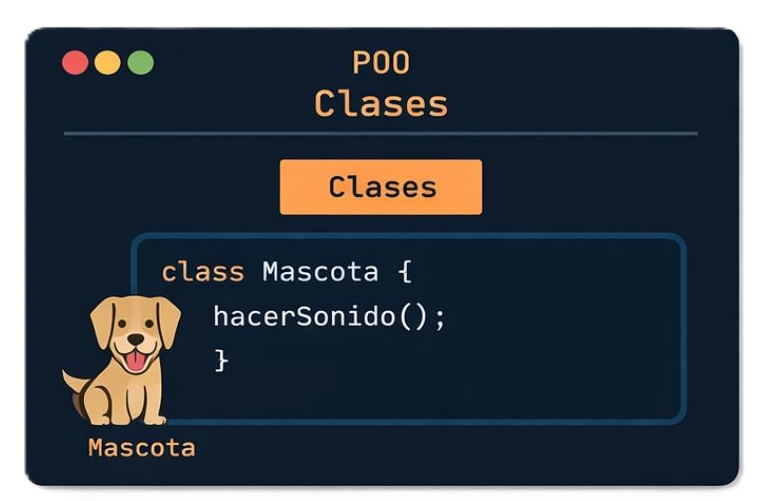
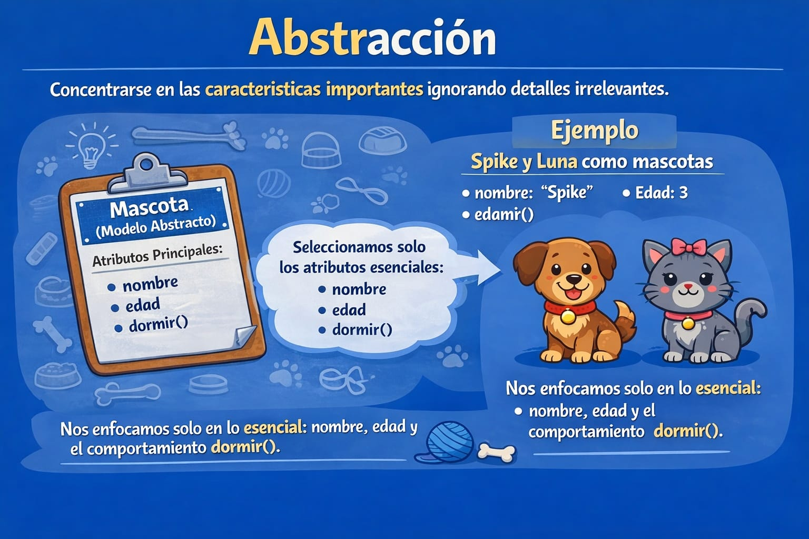
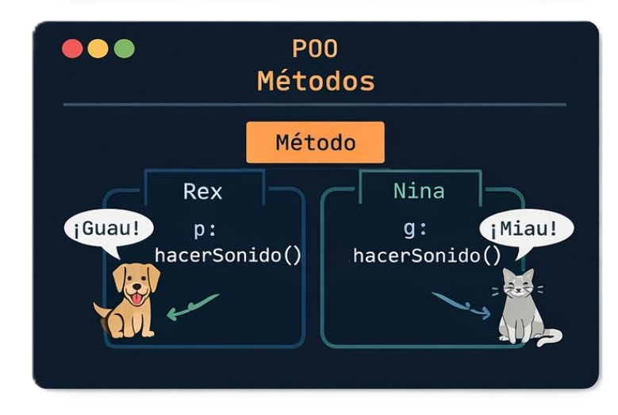
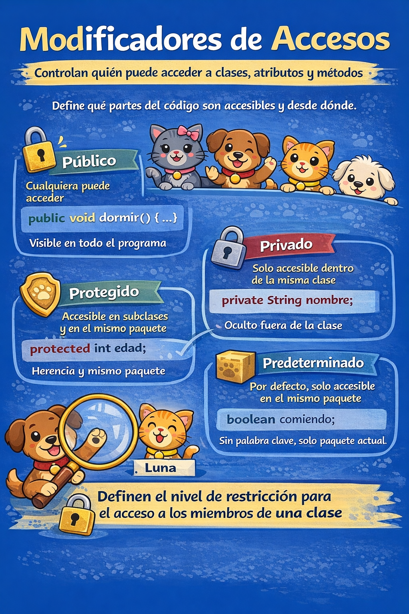
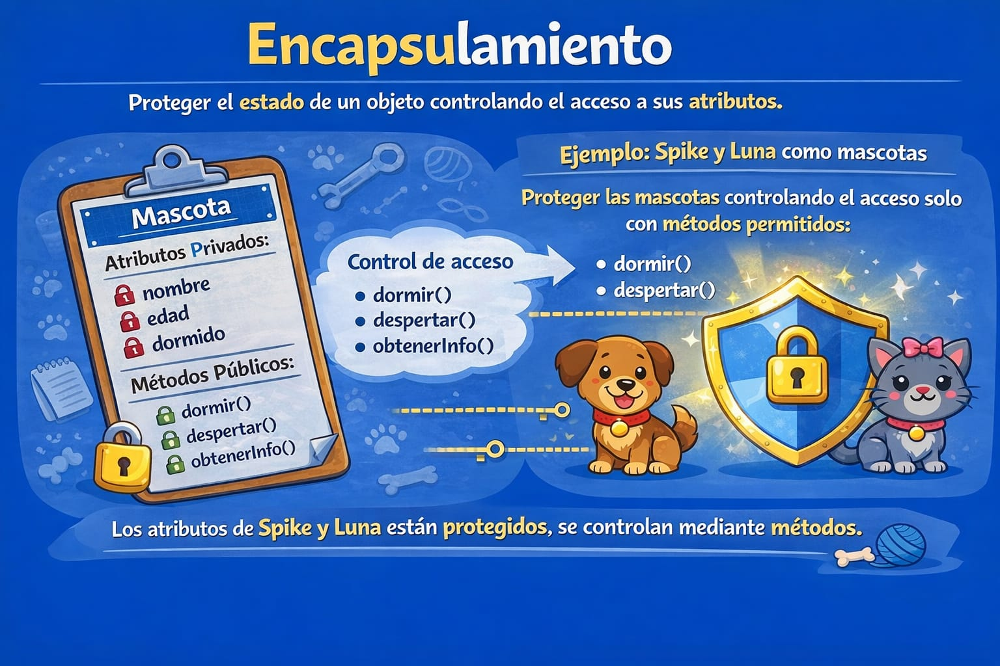
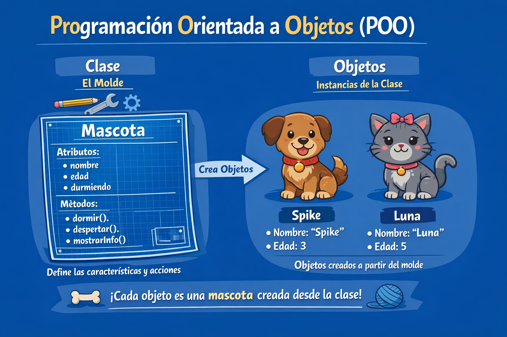

# Programando Orientado a Objetos

En este laboratorio, exploraremos los conceptos fundamentales de la **Programación Orientada a Objetos (POO)**, que nos permitirá organizar y manipular la información de forma modular y reutilizable en el desarrollo de software.

## ¿Qué es POO?
POO organiza el software en **clases y objetos** para mejorar orden, reutilizacion y mantenimiento.

## ¿Qué es una clase?


Una clase define:

- Atributos (características)
- Metodos (acciones)
- Constructores
- Modificadores de acceso

```java
public class Mascota {
    String nombre;
    int edad;
    boolean comiendo;

    public void comer() {
        this.comiendo = true;
        System.out.println("Ñam Ñam Ñam");
    }

    public void hacerSonido() {
        System.out.println("Woof!");
    }
}
```

### Abstracción



Abstraer es modelar solo lo necesario del problema.

### Constructores



Un constructor inicializa el objeto al crearlo.

```Java
    //Constructor predeterminado explícito
    Mascota(){
        System.out.println("Constructor predeterminado")
    }
```

```Java
    //Constructor parametrizado
    public Mascota(String nombre, int edad) {
        this.nombre = nombre;
        this.edad = edad;
        this.comiendo = false;
    }
```

```Java
    //Constructor Copia
    public Mascota(Mascota otraMascota) {
        this.nombre = otraMascota.nombre;
        this.edad = otraMascota.edad;
        this.comiendo = otraMascota.comiendo;
    }

```
> 💡****Nota:**** No es necesario escribir un constructor para una clase. Es porque el compilador java crea un constructor predeterminado (constructor sin argumentos) si su clase no tiene ninguno.

### Modificadores de acceso



- `public`: accesible desde cualquier clase.
- `private`: accesible solo dentro de la clase.
- `protected`: accesible en el mismo paquete y subclases.
- Sin modificador: acceso por paquete.
  
> 💡**Nota**: _Las interfaces y clases anidadas pueden tener todos los modificadores de acceso._  
💡**Nota**: _No podemos declarar clase/interfaz con modificadores de acceso privados o protegidos._

### Encapsulamiento



Encapsular protege los atributos y controla el acceso mediante metodos.

```java
public class Mascota {
    // Atributos encapsulados
    private String nombre;
    private int edad;
    private  boolean  durmiendo;

    // Constructor

    public  Mascota(String  nombre, int  edad, boolean  durmiendo) {
        this.nombre = nombre;
        this.edad = edad;
        this.durmiendo = durmiendo;
    }
    // Métodos de acceso (getters y setters)
    public String getNombre() {
        return nombre;
    }

    public void setNombre(String nombre) {
        this.nombre = nombre;
    }

    public int getEdad() {
        return edad;
    }

    public void setEdad(int edad) {
        this.edad = edad;
    }

    public  boolean  isDurmiendo() {
        return durmiendo;
    }

    public  void  setDurmiendo(boolean  durmiendo) {
        this.durmiendo = durmiendo;
    }
}
```

### Uso de `this` y `super`


- `this`: referencia al objeto actual.
- `super`: referencia a la superclase.

```Java
// Superclase
public  class  Mascota {
    String  nombre;
    int  edad;
    boolean  durmiendo;

    public  Mascota(String  nombre, int  edad, boolean  durmiendo) {
        this.nombre = nombre; // 'this.nombre' es el atributo de la clase
        this.edad = edad;  // 'edad' es el parámetro del constructor
        this.durmiendo = durmiendo;
    }

  

    public  void  hacerSonido() {
        System.out.println("La mascota hace un sonido genérico.");
    }

}

// Subclase
public  class  Perro  extends  Mascota {
    public  Perro(String  nombre, int  edad, boolean  durmiendo) {
        // Llamada al constructor de la superclase
        super(nombre, edad, durmiendo);
    }

    @Override
    public  void  hacerSonido() {
        // Llamada al método de la superclase
        super.hacerSonido();
        System.out.println("El perro ladra: ¡Guau!");
    }

}
```

## Implementando lo que hemos aprendido

``` Java

public  class  Mascota {
    // Atributos
    String  nombre;
    int  edad;
    boolean  durmiendo;

    // Constructor parametrizado
    public  Mascota(String  nombre, int  edad, boolean  durmiendo) {
        this.nombre = nombre;
        this.edad = edad;
        this.durmiendo = durmiendo;
    }

    // Métodos
    public  void  dormir() {
        this.durmiendo = true;
        System.out.println("La mascota está durmiendo.");
    }

    public  void  despertar() {
        this.durmiendo = false;
        System.out.println("La mascota está despierta.");
    }

    public  void  mostrarInfo() {
        System.out.println("Nombre: "  + nombre);
        System.out.println("Edad: "  + edad);
        System.out.println("¿Está durmiendo? "  + (durmiendo ?  "Sí"  :  "No"));
    }
}

```

## ¿Qué es un objeto?


Un objeto es una instancia concreta de una clase.


### Instanciar una clase



Declarar una referencia no crea el objeto; se crea con `new`.

```java
Mascota perro;
perro = new Mascota("Spike", 3);
```

### Inicializar y usar un objeto

```Java
public class Main {

    public static void main(String[] args) {
        Mascota  perro = new  Mascota("Spike", 3, false);
        perro.mostrarInfo();
    }

}
```

**Salida**
****
```shell
Nombre:  Spike
Edad:  3
¿Está  durmiendo?  No
```

## Cierre
POO permite escribir codigo mas claro, reutilizable y facil de mantener mediante clases y objetos.

# Anexos
-   **Documentación oficial de Oracle Java**: Guía completa de la plataforma Java y tutoriales sobre POO.
    
    -   https://docs.oracle.com/en/java/
   -   **Java Cheat Sheet (PDF)**: Resumen rápido de sintaxis y patrones de uso.
    
        -   https://introcs.cs.princeton.edu/java/11cheatsheet/
        
-   **Canal de YouTube "Java Brains"**: Vídeos sobre principios de POO, patrones y buenas prácticas.
    
    -   [https://www.youtube.com/user/koushks](https://www.youtube.com/user/koushks)
