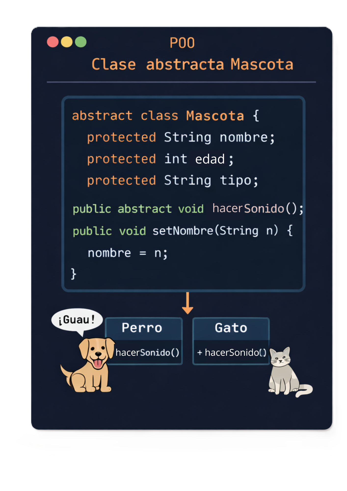
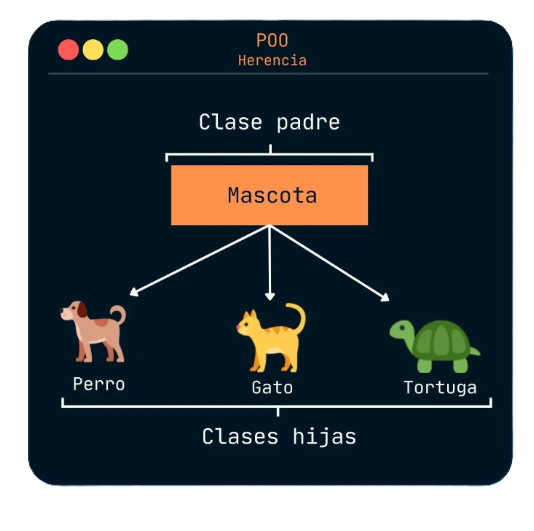
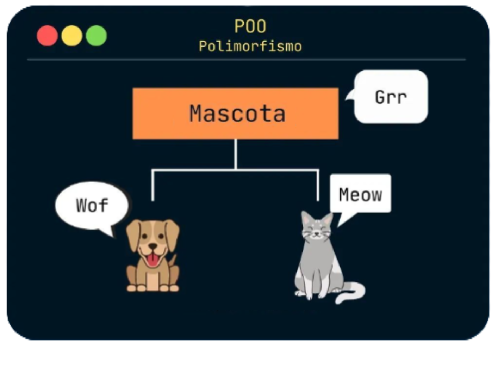
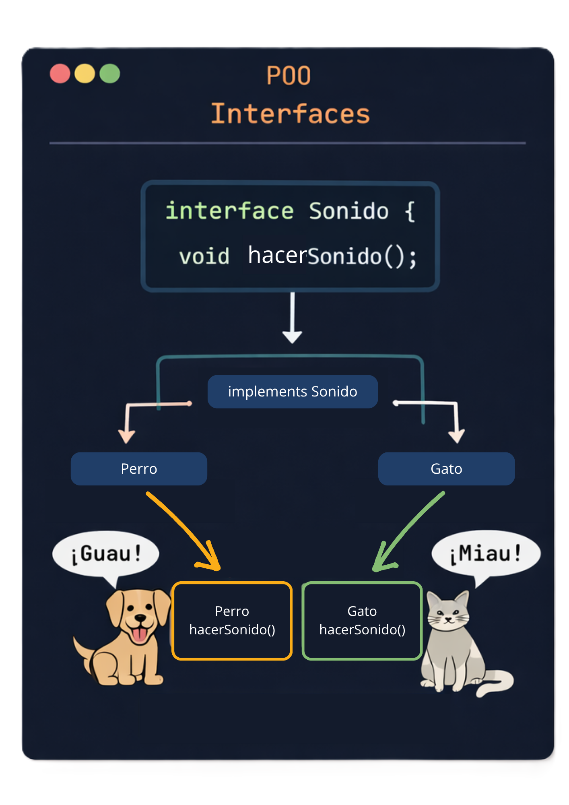


# Programando Orientado a Objetos

  

En este laboratorio, exploraremos los pilares fundamentales de la **Programación Orientada a Objetos (POO)**, que nos permitirá manipular la información de forma modular y reutilizable en el desarrollo de software.

  

## Clases abstractas

  

Una clase abstracta no se puede instanciar y sirve como base.

Para declarar una clase abstracta, usamos la palabra clave **`abstract`**:

```Java
abstract  class  Mascota {
	protected  String  nombre;

	public  Mascota(String  nombre) {
		this.nombre = nombre;
	}

	public  abstract  void  hacerSonido();
}
```

  

> 💡Nota: Obliga a las clases hijas a implementar métodos

  



  

> 💡Nota: En estos casos se recomienda que los atributos esten

> protegidos

  

## Herencia

  



  

La herencia permite que una clase hija reutilice atributos y métodos de una clase padre.

  

Para aplicar herencia en Java, usamos la palabra clave **`extends`**, que indica que una clase está heredando de otra.

```Java
abstract  class  Mascota {
	protected  String  nombre;

	public  Mascota(String  nombre) {
		this.nombre = nombre;
	}
		
	public  void  mostrarNombre() {
		System.out.println(nombre);
	}
}

class  Perro  extends  Mascota {
	public  Perro(String  nombre) {
		super(nombre);
	}

	public  void  hacerSonido() {
		System.out.println("Guau");
	}
}
```

  

> 💡 `extends` permite heredar

> 💡 `this` objeto actual

> 💡 `super` llama al constructor de la clase padre

  

## Polimorfismo

  



  

El **polimorfismo** es un concepto fundamental que permite que los objetos de diferentes clases respondan de manera distinta a un mismo método.

  

### Tipos de polimorfismo

  

#### Polimorfismo en tiempo de compilación (Sobrecarga de métodos)

  

Un mismo método puede tener diferentes versiones según sus parámetros.

  

```Java
class  Mascota {

	void  hacerSonido() {
		System.out.println("La mascota hace un sonido.");
		}

	void  hacerSonido(String  sonido) {
		System.out.println(sonido);
		}
}

Mascota  m = new  Mascota();

m.hacerSonido(); //La mascota hace un sonido
m.hacerSonido("Guau!"); //Guau!
```

  

#### **Polimorfismo en Tiempo de Ejecución** (Anulación de Métodos)

  

Cada clase hija define su propio comportamiento.

  

```Java
class  Perro  extends  Mascota {
	@Override
	public  void  hacerSonido() {
		System.out.println("Guau");
	}
}

class  Gato  extends  Mascota {
	@Override
	public  void  hacerSonido() {
		System.out.println("Miau");
	}
}
```

> 💡**Extra**: Esto puedes aplicarlo usando una clase abstracta o una interfaz y así no usar `@Override`

  

## Interfaces

  



  

Una interfaz define métodos que deben implementarse.

  

```Java
interface  Mostrable {
	void  mostrarInfo();
}

class  Perro  extends  Mascota  implements  Mostrable {
	public  Perro(String  nombre) {
		super(nombre);
	}

	@Override
	public  void  hacerSonido() {
		System.out.println("Guau");
	}

	@Override
	public  void  mostrarInfo() {
		System.out.println("Soy un perro llamado "  + nombre);
	}
}
```

> 💡 `implements` en lugar de `extends`

  ## Implementando lo que hemos aprendido
[Ver  Ejemplo](https://github.com/meaguilar/POO-2026/blob/main/Ejercicios-Laboratorios/Laboratorio-2/Mascota/src/main/java/Main.java)


# Anexos

-  **Documentación oficial de Oracle Java**: Guía completa de la plataforma Java y tutoriales sobre POO.

- https://docs.oracle.com/en/java/

-  **Java Cheat Sheet (PDF)**: Resumen rápido de sintaxis y patrones de uso.

- https://introcs.cs.princeton.edu/java/11cheatsheet/

-  **Canal de YouTube "Java Brains"**: Vídeos sobre principios de POO, patrones y buenas prácticas.

- [https://www.youtube.com/user/koushks](https://www.youtube.com/user/koushks)
