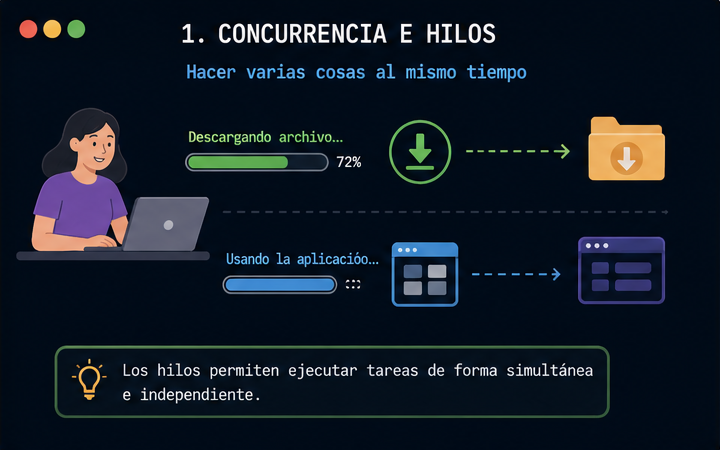
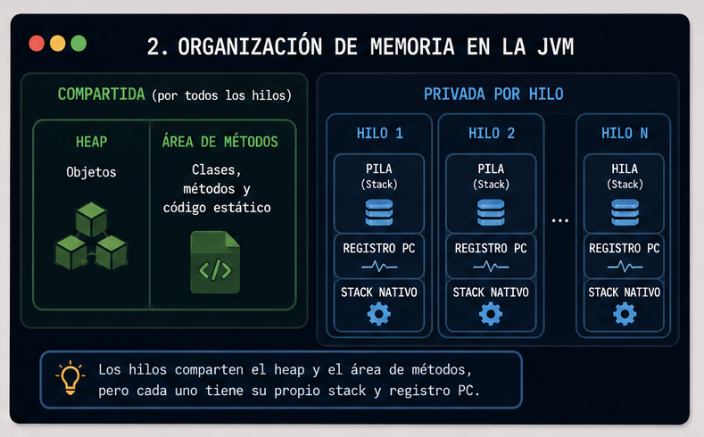
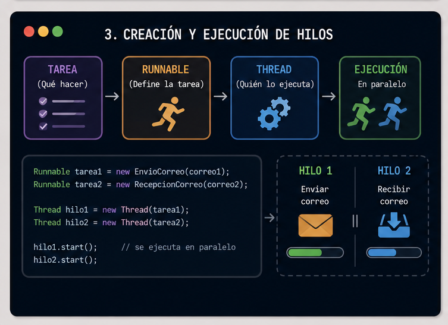
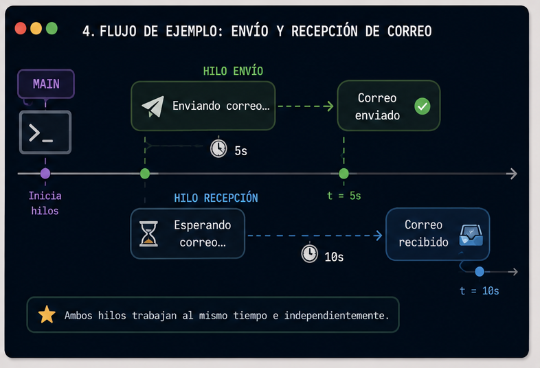

  

# Hilos en Java

  

  

En este laboratorio, exploraremos la concurrencia y el uso de hilos (Threads), que nos permitirá ejecutar múltiples tareas de forma simultánea e independiente en el desarrollo de software.

  

  

## Concurrencia e Hilos

  



  

> 💡 Nos ayudan a crear aplicaciones que pueden hacer varias cosas al mismo tiempo (como descargar un archivo mientras sigues usando la interfaz), compartiendo la misma memoria.

  

  

---

  

  

## Organización de Memoria en la JVM

  



  

La JVM divide la memoria en dos tipos:


| Tipo | Área | Descripción |  
|------------------|--------------------------|-----------------------------------------------|  
| Compartida | Heap | Objetos creados con `new` |  
| Compartida | Área de métodos | Clases, métodos y código estático |  
| Privada por hilo | Pila (Stack) | Variables locales y llamadas a métodos |  
| Privada por hilo | Registro PC | Instrucción actual que ejecuta el hilo |  
| Privada por hilo | Stack de métodos nativos | Código externo C/C++ |

  

> Los hilos comparten objetos del heap, pero cada uno tiene su propio espacio de ejecución (stack y PC).

  
  

---

  

  

## Creación de Hilos

  

  

Java nos ofrece herramientas para crear hilos, permitiendo separar qué tarea se va a ejecutar y quién la va a ejecutar.

  



  
  

> 💡 Se basa en usar **herencia (`Thread`)** o **interfaces (`Runnable`)** para definir las tareas concurrentes.

  

  

---

  

  

## Uso de hilos

  



  

Definimos la clase de nuestro objeto base que manejará un estado (`PENDIENTE` o `RECIBIDO`) usando un `enum`.

  

  

```java

public class Correo extends Mensaje {  
  
    private Estado estado;  
  
    public Correo() {  
    }  
  
    public Correo(String remitente, String destinario, String asunto) {  
        super(remitente, destinario, asunto);  
        this.estado = estado.PENDIENTE;  
    }  
  
    public Estado getEstado() {  
        return estado;  
    }  
  
    public void setEstado(Estado estado) {  
        this.estado = estado;  
    }  
  
    // metodos  
    public boolean enviarCorreo(Correo correo) {  
        if (correo != null) {  
            return true;  
        }  
        return false;  
    }  
  
    public void recibirCorreo() {  
        // CAMBIAR EL ESTADO  
        this.estado = estado.RECIBIDO;  
        System.out.println("Estado: " + this.getEstado());  
    }  
}
```

  

  

> 💡 La clase base maneja la información estática, pero su estado cambiará en tiempo real gracias a la ejecución de los hilos.

  

  

---

  

  

La clase `EnvioCorreo` implementa `Runnable` y define la tarea de envío: espera 5 segundos simulando el tiempo de red y luego muestra los detalles del correo enviado.

  

  

```java
public class EnvioCorreo implements Runnable {  
  
    Correo correo;  
  
    public EnvioCorreo(Correo correo) {  
        this.correo = correo;  
    }  
  
    @Override  
    public void run() {  
        try {  
  
            System.out.println("\nEnviando correo...");  
  
            // Espera de 5 segundos  
            Thread.sleep(5000);  
  
            boolean enviado = correo.enviarCorreo(correo);  
  
            if (enviado) {  
                System.out.println("\nDetalles del correo enviado: ");  
                correo.mostrarMensaje();  
            } else {  
                System.out.println("Error al enviar el correo");  
            }  
  
        } catch (InterruptedException e) {  
            // Detalles técnicos del error  
            e.printStackTrace();  
            // mensaje personalizado  
            System.out.println("El envío fue interrumpido");  
        }  
    }  
}

```

  

  

> 💡 Usamos `implements Runnable` porque estamos definiendo la tarea (el *qué hacer*) separada del hilo en sí. Usamos `Thread.sleep()` para simular tiempos de proceso.

  

  

---

  

  

La clase `RecepcionCorreo` también implementa `Runnable` y define la tarea de recepción: espera 10 segundos simulando la llegada del mensaje y luego actualiza el estado del correo a `RECIBIDO`.

  

  

```java
public class RecepcionCorreo implements Runnable {  
  
    private Correo correo;  
  
    public RecepcionCorreo(Correo correo) {  
        this.correo = correo;  
    }  
  
    @Override  
    public void run() {  
        try {  
  
            // Espera de 10 segundos  
            Thread.sleep(10000);  
            System.out.println("\n Bandeja de entrada (correos recibidos) .... ");  
            correo.recibirCorreo();  
            correo.mostrarMensaje();  
  
        } catch (InterruptedException e) {  
            // Detalles técnicos del error  
            e.printStackTrace();  
            // mensaje personalizado  
            System.out.println("La recepción fue interrumpida");  
        }  
  
    }  
}
```

  
  

> 💡 Cada clase implementa su propia versión del método `run()`, definiendo tiempos y lógicas completamente independientes.

  
  

---

  

  

Solo asignamos los objetos (`EnvioCorreo` o `RecepcionCorreo`) a los hilos constructores de Java.

  


| Característica | `extends Thread` | `implements Runnable` |
|----------------|------------------|------------------------|
| Herencia | Ocupa la herencia (no puede extender otra clase) | Libre para extender otras clases |
| Flexibilidad | Menor | Mayor ✅ |
| Inicio | `hilo.start()` | `new Thread(tarea).start()` |
| Uso recomendado | Cuando el hilo ES la tarea | Cuando la tarea es independiente del hilo |

  

  

En `Main`, creamos las instancias de los `Runnable`, las envolvemos en objetos `Thread` y arrancamos ambos hilos de forma concurrente con `.start()`.

  

  

```java

public class Main {  
    public static void main(String[] args) {  
  
        Correo correoEnviar =  
                new Correo("uca@uca.edu.sv",  
                        "poo@uca.edu.sv",  
                        "Primer correo");  
  
        Correo correoRecibir = new Correo(  
                 "poo@uca.edu.sv",  
                 "secciones_poo@uca.edu.sv",  
                "Cuarto laboratorio POO");  
  
        // Creando los objetos (tareas) de la clase que implementa Runnable  
		// Simulando un envio y un recepcion de correo  EnvioCorreo envio = new EnvioCorreo(correoEnviar);  
        RecepcionCorreo recepcion = new RecepcionCorreo(correoRecibir);  
  
        // Creando el hilo para agregar los objetos (tareas) 
        Thread hiloEnvio = new Thread(envio);  
        Thread hiloRecepcion = new Thread(recepcion);  
  
        // Iniciando los hilos  
        hiloEnvio.start();  
        hiloRecepcion.start();  
  
    }  
}
```

  

> 💡 Ya no ejecutamos los métodos directamente. Usamos la clase `Thread` pasando la interfaz como parámetro y arrancamos la concurrencia usando `.start()`.

  

  

---

  

  

## Ejemplo

  

  

[Ver Clases de Hilos](https://github.com/meaguilar/POO-2026/blob/3eca83e694f6ddbab8a824ef4bb888338179188b/Ejercicios-Laboratorios/Laboratorio-4/GestionCorreosHilos/src/main/java/Main.java)

  

  

---

  

  

## Anexos

  

  

-  **Documentación oficial de Oracle Java:** Guía completa de la plataforma Java y manejo de la clase Thread.

  

[https://docs.oracle.com/en/java/javase/17/docs/api/java.base/java/lang/Thread.html](https://docs.oracle.com/en/java/javase/17/docs/api/java.base/java/lang/Thread.html)

  

  

-  **Java Threads — GeeksForGeeks:** Tutorial completo de creación de hilos y concurrencia.

  

[https://www.geeksforgeeks.org/java/java-threads/](https://www.geeksforgeeks.org/java/java-threads/)

  

  

-  **Runnable Interface in Java — GeeksForGeeks:** Explicación de la interfaz Runnable.

  

[https://www.geeksforgeeks.org/java/runnable-interface-in-java/](https://www.geeksforgeeks.org/java/runnable-interface-in-java/)
