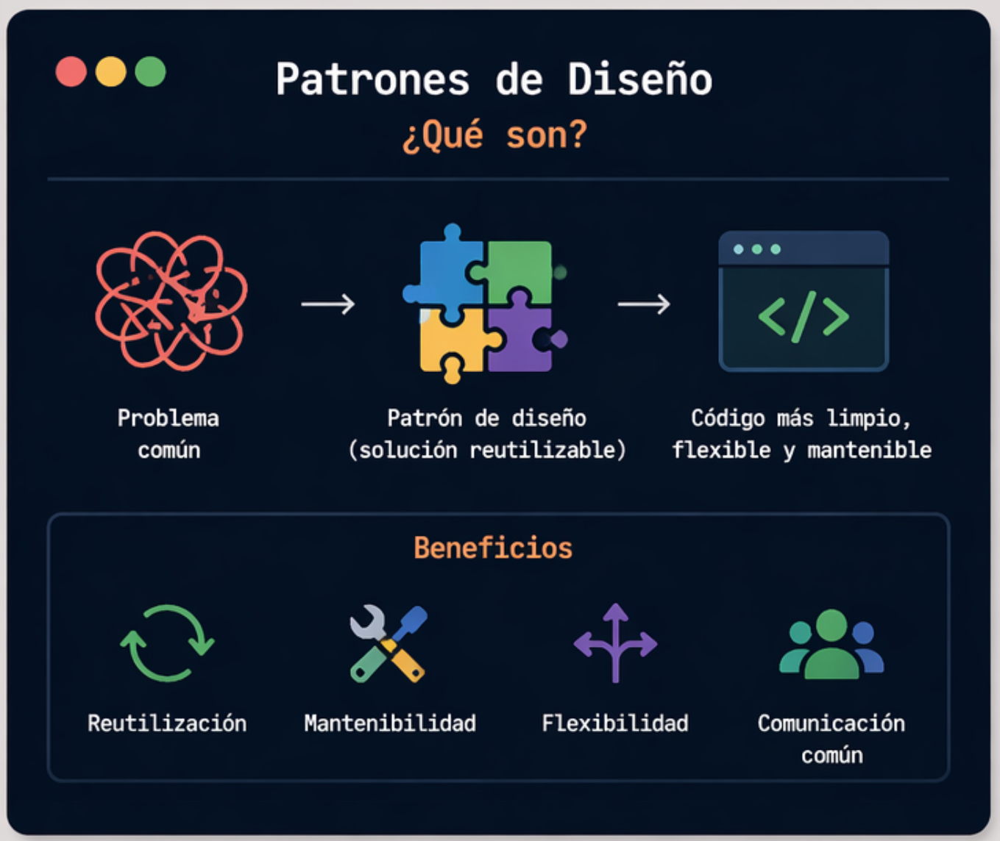
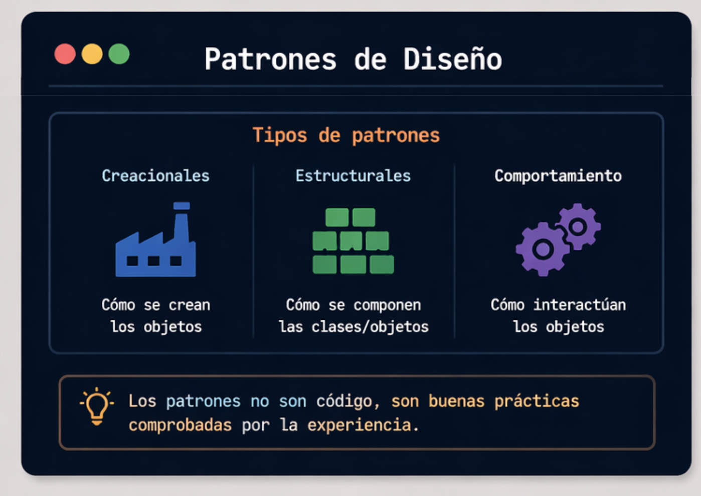
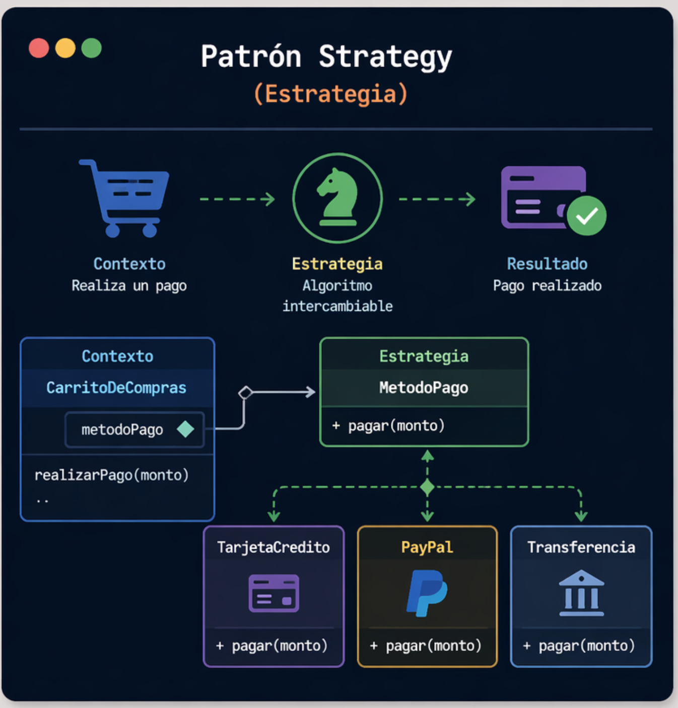

# Programando Orientado a Objetos

En este laboratorio, exploraremos los patrones de diseño, que nos permitirá manipular la información de forma modular y reutilizable en el desarrollo de software.

### Patrones de Diseño



> 💡 Nos ayudan a escribir código más organizado, flexible y reutilizable.
  

### Tipos de Patrones de Diseño




## Patron Strategy

El patrón **Strategy** permite cambiar el comportamiento de un objeto sin modificar su código.



> 💡 Se basa en usar **interfaces** para definir diferentes formas de hacer algo.

#### Uso del patron

Definimos una **interfaz** con el comportamiento común (pagar).  
```Java
interface MetodoPago {  
void pagar(double monto);  
}
```
```Java
class PagoTarjeta implements MetodoPago {
    public void pagar(double monto) {
        System.out.println("Pagando con tarjeta: $" + monto);
    }
}
```
> 💡 Usamos `implements` porque estamos creando una clase concreta basada en la interfaz.
```Java

class PagoEfectivo implements MetodoPago {
    public void pagar(double monto) {
        System.out.println("Pagando en efectivo: $" + monto);
    }
}
```
> 💡 Cada clase define su propia forma de pagar .
```Java
class Compra {
    private MetodoPago metodo;

    public Compra(MetodoPago metodo) {
        this.metodo = metodo;
    }

    public void realizarPago(double monto) {
        metodo.pagar(monto);
    }
}
```
>💡 Ya no usamos `implements` si no que usamos la interfaz como **tipo de dato** y podemos cambiar el comportamiento sin modificar la clase

Solo cambiamos el objeto (`PagoTarjeta` o `PagoEfectivo`)

```Java
public class Main {
    public static void main(String[] args) {

        Compra c1 = new Compra(new PagoTarjeta());
        c1.realizarPago(50);

        Compra c2 = new Compra(new PagoEfectivo());
        c2.realizarPago(30);
    }
}
```
### Ejemplo
[Ver Clase MetodoPago.java](https://github.com/meaguilar/POO-2026/blob/main/Ejercicios-Laboratorios/Laboratorio-3/Estrategia-Metodo-de_Pago/src/main/java/Main.java)

# Anexos
-   **Documentación oficial de Oracle Java**: Guía completa de la plataforma Java y tutoriales sobre POO.
    
    -   https://docs.oracle.com/en/java/
   -   **Java Cheat Sheet (PDF)**: Resumen rápido de sintaxis y patrones de uso.
    
        -   https://introcs.cs.princeton.edu/java/11cheatsheet/
        
-   **Canal de YouTube "Java Brains"**: Vídeos sobre principios de POO, patrones y buenas prácticas.
    
    -   [https://www.youtube.com/user/koushks](https://www.youtube.com/user/koushks)

-   **Pagina Web Refactoring Guru**: Biblioteca de informacion e imagenes sobre patrones de diseño.
	- https://refactoring.guru/design-patterns


