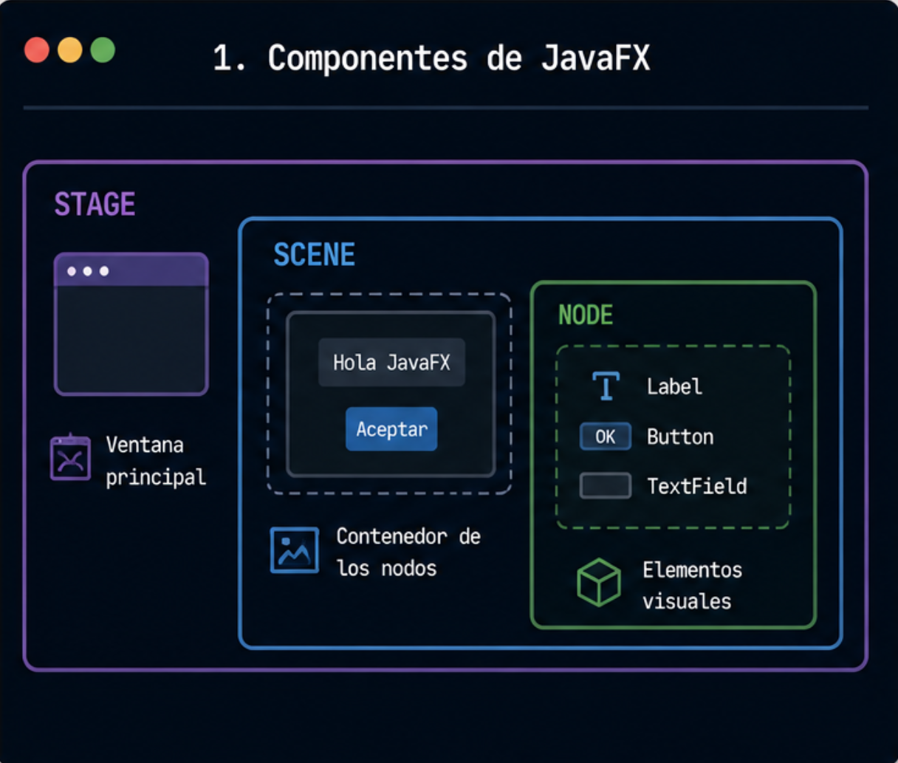
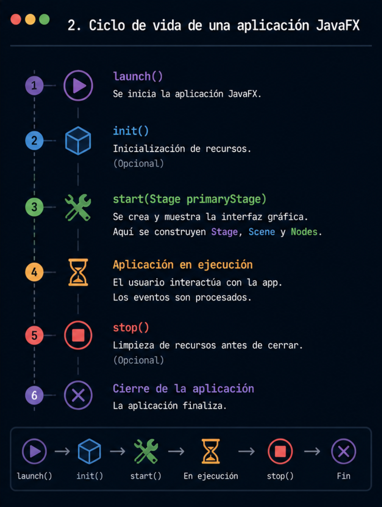
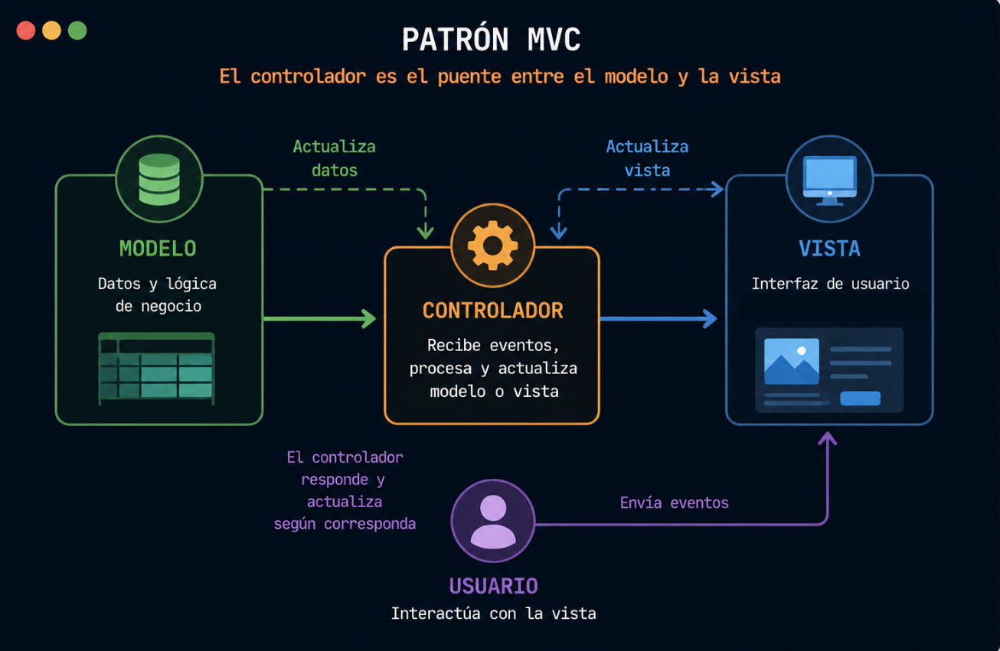
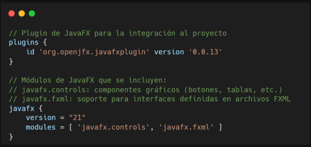
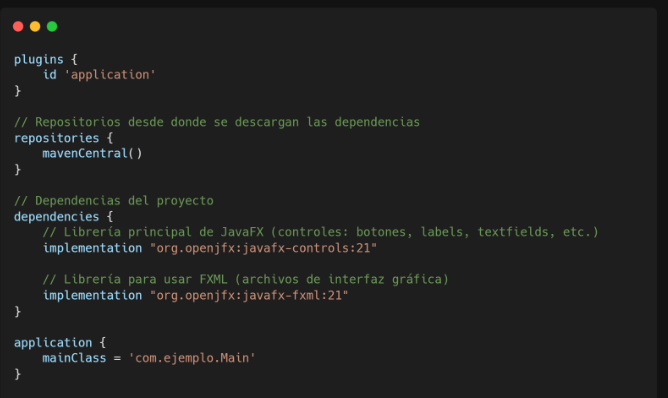

  
# Interfaces Gráficas con JavaFX

En este laboratorio, exploraremos el desarrollo de interfaces gráficas de usuario (GUI) utilizando JavaFX. Aprenderemos su arquitectura fundamental, el ciclo de vida de una aplicación y cómo aplicar el patrón MVC para mantener nuestro código ordenado y escalable.

## Componentes Principales de JavaFX

  La interfaz se construye utilizando tres elementos jerárquicos esenciales:



> 💡 **En resumen:** El *Stage* es la ventana, la *Scene* es el lienzo que colocamos dentro, y los *Nodes* son los dibujos o componentes que rellenan ese lienzo.

## Ciclo de Vida de una Aplicación JavaFX
  


---

## Diseñar una GUI con JavaFX

### 1. Contenedores (Layouts)

| Contenedores | Descripción | Propiedades comunes |
| :--- | :--- | :--- |
| **VBox** | Contenedor que organiza los nodos hijos verticalmente en una sola columna. | `spacing`, `padding`, `alignment` |
| **HBox** | Contenedor que organiza los nodos hijos horizontalmente en una sola fila. | `spacing`, `padding`, `alignment` |
| **GridPane** | Contenedor flexible que alinea los componentes en una cuadrícula (rejilla de filas y columnas). | `hgap`, `vgap`, `alignment` |
| **BorderPane** | Distribuye los elementos en cinco regiones predefinidas: superior (top), inferior (bottom), izquierda (left), derecha (right) y centro (center). | `top`, `bottom`, `left`, `right`, `center` |
| **StackPane** | Coloca los nodos hijos en una pila, superponiéndolos unos encima de otros (de atrás hacia adelante). | `alignment`, `padding` |

---

### 2. Controles de Interfaz (UI Controls)

| Controles | Descripción | Propiedades comunes | Eventos principales |
| :--- | :--- | :--- | :--- |
| **Button** | Botón que ejecuta una acción al hacer clic. | `text`, `disable`, `style` | `setOnAction` |
| **Label** | Muestra texto informativo no editable. | `text`, `font`, `style` | No aplica |
| **TextField** | Campo de entrada de texto de una sola línea. | `text`, `promptText`, `editable` | `setOnAction`, cambio de texto |
| **ComboBox** | Lista desplegable para seleccionar una opción. | `items`, `value`, `editable` | `setOnAction` |
| **TableView** | Tabla estructurada para desplegar colecciones de datos en filas y columnas. | `items`, `columns` | Selección de filas, edición de celdas |

### 3. Sistema de Manejo de Eventos

| Evento FXML | Propiedad JavaFX | ¿Qué hace este evento? |
| :--- | :--- | :--- |
| `onAction` | `ActionEvent` | Se dispara al activar un control básico (como hacer clic en un botón o presionar Enter en un campo de texto). |
| `onMouseClicked` | `MouseEvent` | Se gatilla al presionar y soltar cualquier botón del mouse sobre un nodo específico. |
| `onKeyPressed` | `KeyEvent` | Se activa en el instante preciso en que el usuario presiona una tecla del teclado físico teniendo el foco en el componente. |
| `onMouseEntered` | `MouseEvent` | Se dispara cuando el puntero del cursor entra en el límite o área visible de un componente. |
| `onScroll` | `ScrollEvent` | Se ejecuta al usar la rueda del mouse o gestos de desplazamiento en el panel táctil sobre un nodo. |

## Arquitectura de Software: Patrón MVC

JavaFX está nativamente diseñado para trabajar bajo el patrón **MVC (Modelo - Vista - Controlador)**, separando la lógica de negocio de la interfaz gráfica a través de archivos **FXML**.



* **Modelo:** Representa los datos y las reglas del negocio de nuestra aplicación. No sabe nada de botones ni de pantallas.
* **Vista (FXML):** Es el archivo XML que define la estructura jerárquica de los nodos gráficos (el diseño visual).
* **Controlador:** Actúa como el puente interactivo. Escucha las interacciones de la Vista, modifica o consulta el Modelo, y actualiza la pantalla en consecuencia.

## Uso de la anotación @FXML en los controladores de JavaFX

En JavaFX, **@FXML** es una anotación que se utiliza para conectar el archivo FXML con el controller en Java. Se emplea tanto en variables, como en controles de la interfaz (Button, TextField, Label, entre otros), como en métodos que manejan eventos, por ejemplo, el clic de un botón.
Su principal función es permitir que el controller acceda a los componentes definidos en el FXML y pueda manejar las acciones del usuario, facilitando así la conexión entre la vista y la lógica de la aplicación.

## Ejercicio de Ejemplo

> 💡 Agregar antes del ejercicio práctico que para poder implementar JavaFX es necesario configurar el build.gradle

**Opción 1:** Implementando el plugin de JavaFX

* [https://github.com/openjfx/javafx-gradle-plugin](https://github.com/openjfx/javafx-gradle-plugin)



**Opcion 2:** SIN plugin (solo Maven Central puro)

* [https://central.sonatype.com/artifact/org.openjfx/javafx-fxml/21](https://central.sonatype.com/artifact/org.openjfx/javafx-fxml/21)

* [https://central.sonatype.com/artifact/org.openjfx/javafx-controls/21](https://central.sonatype.com/artifact/org.openjfx/javafx-controls/21)



### 1. El `Main` y el cambio en el ciclo de ejecución

> ⚠️ **Nota importante:** En las aplicaciones de consola tradicionales, todo el código se ejecutaba de forma secuencial dentro del método `main`. En JavaFX esto cambia por completo: la clase debe extender de `Application` y el método `main` ahora solo sirve para invocar a `launch()`, delegando el control al ciclo de vida gráfico en el método `start()`.

```java
public class Main extends Application {
    @Override
    public void start(Stage stage) throws Exception {
        // Carga la jerarquía de la vista desde el archivo FXML
        FXMLLoader loader = new FXMLLoader(Main.class.getResource("/conversor-view.fxml"));
        Scene scene = new Scene(loader.load(), 400, 500);

        // Configuración del Stage (Escenario/Ventana principal)
        stage.setTitle("Calculadora Decimal ↔ Binario");
        stage.setScene(scene);
        stage.setResizable(false); // Evita que el usuario deforme el diseño
        stage.show(); // Muestra la ventana
    }

    public static void main(String[] args) {
        launch(); // Enciende el motor de JavaFX e inicia el ciclo de vida
    }
}
```

### 2. El Modelo (Encapsulamiento y Estrategias)

El modelo no conoce la existencia de botones ni pantallas. Maneja exclusivamente la lógica matemática de conversión y las reglas del negocio mediante polimorfismo:

```java
// patterns.strategy.EstrategiaConversion
public interface EstrategiaConversion {
    String convertir(String valor);
}

// model.Conversor (Clase de contexto que interactúa con la estrategia)
public class Conversor {
    private String valor;
    private EstrategiaConversion estrategia;

    public String ejecutarConversion() {
        if (valor == null || valor.trim().isEmpty()) {
            throw new IllegalArgumentException("Ingresa una cantidad.");
        }
        if (estrategia == null) {
            throw new IllegalStateException("No se ha definido la estrategia.");
        }
        return estrategia.convertir(valor);
    }
    // Getters y Setters...
}
```

### 3. La Vista (Fragmento del archivo FXML)

En el archivo `conversor-view.fxml` definimos visualmente la interfaz. Observa cómo asociamos el controlador general a la raíz y cómo mapeamos las propiedades clave de interacción como `fx:id` y `onAction`:

```xml
<AnchorPane fx:controller="controller.ConversorController" xmlns:fx="http://javafx.com/fxml">
    <TextField fx:id="txtCantidad" promptText="Ingresa un valor" />

    <Button text="Convertir" onAction="#convertir" styleClass="btn-convertir" />

    <Label fx:id="lblResultado" text="---" />
</AnchorPane>
```

### 4. El Controlador (El Puente de Comunicación)

```java
public class ConversorController {
    // Vincular componentes de la vista mediante anotaciones @FXML
    @FXML private TextField txtCantidad;
    @FXML private ComboBox<String> cbxDe;
    @FXML private ComboBox<String> cbxA;
    @FXML private Label lblResultado;

    private Conversor conversor;

    @FXML
    public void initialize() {
        conversor = new Conversor(); // Instancia del modelo al iniciar la vista
        cbxDe.getItems().addAll("Decimal", "Binario");
        cbxA.getItems().addAll("Binario", "Decimal");
    }

    @FXML
    void convertir(ActionEvent event) {
        try {
            String cantidad = txtCantidad.getText().trim();
            String de = cbxDe.getValue();
            String a = cbxA.getValue();

            // Validaciones de negocio en la UI
            if (de.equals(a)) {
                throw new IllegalArgumentException("Debes seleccionar conversiones diferentes.");
            }

            // Inyección de valores y estrategias al Modelo
            conversor.setValor(cantidad);
            if (de.equals("Decimal") && a.equals("Binario")) {
                conversor.setEstrategia(new DecimalABinario());
            } else if (de.equals("Binario") && a.equals("Decimal")) {
                conversor.setEstrategia(new BinarioADecimal());
            }

            // Ejecución delegada y actualización de la Vista
            String resultado = conversor.ejecutarConversion();
            lblResultado.setText(resultado);
            mostrarAlertaInformacion("Conversión exitosa", "La conversión se realizó correctamente.");

        } catch (IllegalArgumentException | IllegalStateException e) {
            mostrarAlertaError("Error de validación", e.getMessage());
        }
    }

    // Métodos auxiliares para la gestión de Alerts flotantes
    private void mostrarAlertaError(String titulo, String mensaje) {
        Alert alert = new Alert(Alert.AlertType.ERROR, mensaje, ButtonType.OK);
        alert.setTitle(titulo);
        alert.setHeaderText(null);
        alert.showAndWait(); // Pausa la ejecución hasta recibir confirmación
    }
}
```

## Ejemplo Completo

[Ver Conversor de Decimal y Binario en JavaFX](https://github.com/meaguilar/POO-2026/tree/main/Ejercicios-Laboratorios/Laboratorio-5/Decimal-Binario)

## Anexos

* Plataforma oficial para buscar, gestionar y descargar dependencias y librerías de proyectos Java y otros ecosistemas desde Maven Central. [https://central.sonatype.com](https://central.sonatype.com/)

* Herramienta visual de arrastrar y soltar para diseñar interfaces gráficas JavaFX mediante archivos FXML de forma rápida y sencilla.[https://gluonhq.com/products/scene-builder/](https://gluonhq.com/products/scene-builder/)

* Tutorial práctico que explica cómo crear interfaces gráficas en JavaFX usando Scene  Builder mediante diseño visual con drag-and-drop y archivos FXML. [https://www.tutkit.com/en/text-tutorials/13151-gui-development-with-scene-builder-in-javafx](https://www.tutkit.com/en/text-tutorials/13151-gui-development-with-scene-builder-in-javafx)

* Tutorial práctico que enseña a usar JavaFX  Scene Builder para diseñar interfaces gráficas con FXML, controles visuales y manejo de eventos en aplicaciones JavaFX. [https://examples.javacodegeeks.com/java-development/desktop-java/javafx/scene/javafx-scene-builder-tutorial/](https://examples.javacodegeeks.com/java-development/desktop-java/javafx/scene/javafx-scene-builder-tutorial/)

* Documentación oficial de JavaFX que explica los paneles de diseño (HBox, VBox, GridPane, BorderPane, etc.) para organizar interfaces gráficas. [https://docs.oracle.com/javafx/2/layout/builtin_layouts.htm](https://docs.oracle.com/javafx/2/layout/builtin_layouts.htm)

* Librería de componentes modernos con estilo Material Design para crear interfaces gráficas avanzadas en JavaFX. [https://github.com/palexdev/MaterialFX?tab=readme-ov-file](https://github.com/palexdev/MaterialFX?tab=readme-ov-file)

* Biblioteca de iconos gratuitos y personalizables para interfaces web y aplicaciones: [https://boxicons.com/icons?free=true](https://boxicons.com/icons?free=true)

* Plataforma de fotografías gratuitas en alta calidad para uso personal y comercial. [https://unsplash.com](https://unsplash.com/)

* Herramienta online para generar, explorar y combinar paletas de colores para diseño gráfico, web y branding. [https://coolors.co](https://coolors.co/)
