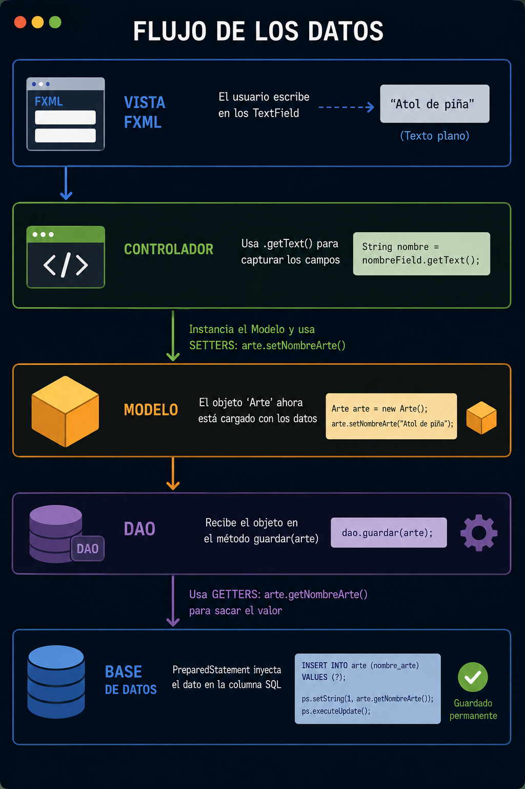

# Persistencia de Datos en Java

En este laboratorio, aprenderemos las operaciones fundamentales de manipulación de datos (CRUD) y cómo estructurar el código con el patrón de diseño DAO y conexion con base de datos.

---

## Tipos de Persistencia de Datos

Los tipos de persistencia se clasifican según la forma en que la información se almacena y se gestiona dentro de un sistema:

| Tipo de Persistencia | Formato de Almacenamiento |
| :--- | :--- |
| **Bases de Datos Relacionales** | Tablas estructuradas (filas y columnas) con relaciones definidas.|
| **Bases de Datos No Relacionales (NoSQL)** | Documentos flexibles de texto estructurado (JSON).|
| **Archivos Planos** | Archivos de texto locales almacenados directamente en el disco.|
| **Persistencia en la Nube** | Servidores remotos vía Internet. |

---

## Manipulación de Datos y Operaciones CRUD

Para interactuar con cualquier sistema de persistencia, utilizamos el acrónimo **CRUD**, que representa las cuatro acciones fundamentales:


---

## El Patrón de Diseño DAO (Data Access Object)

El patrón **DAO** es una técnica de arquitectura de software que permite **separar por completo la lógica de negocio de la lógica de acceso a datos**.

### Componentes de la Arquitectura DAO

Para implementar este patrón de manera ordenada, dividimos nuestro sistema en cuatro roles bien definidos:


## Flujo de los Datos 




## Ejercicio de Implementación:

A continuación se muestran algunos fragmentos: vista, controlador, entidad, DAO y conexión.

### 1. Vista FXML

```xml
<StackPane fx:controller="controller.GaleriaController"
		   stylesheets="@css/styles.css">
	<TilePane fx:id="tileContenedorObras" />
	<StackPane fx:id="overlayBackdrop" visible="false" managed="false" />
</StackPane>
```

Este archivo define la pantalla de JavaFX. También se prepara el overlay que sirve para los modales.

### 2. Controlador de la galería

```java
@FXML
public void initialize() {
	instancia = this;
	cerrarTodosLosModales();
	cargarArtes();
}

@FXML
private void manejarGuardar(ActionEvent e) {
	String nombre = txtAgregarNombre.getText().trim();
	String url = txtAgregarUrl.getText().trim();
	if (nombre.isEmpty() || url.isEmpty()) return;

	Arte arte = new Arte();
	arte.setNombreArte(nombre);
	arte.setUrlArte(url);

	if (arteDAO.guardar(arte)) {
		cargarArtes();
		cerrarTodosLosModales();
	}
}
```


### 3. Entidad `Arte`

```java
public class Arte {
	private int idArte;
	private String nombreArte;
	private String urlArte;

	public Arte(int idArte, String nombreArte, String urlArte) {
		this.idArte = idArte;
		this.nombreArte = nombreArte;
		this.urlArte = urlArte;
	}
}
```

Esta clase guarda los datos de cada obra. Es el objeto que funciona como modelo principal.

### 4. Contrato DAO

```java
public interface ArteDAO {
	boolean guardar(Arte arte);
	boolean actualizar(Arte arte);
	boolean eliminar(int idArte);
	Arte buscarPorId(int idArte);
	List<Arte> listarTodos();
}
```

Aquí se definen las operaciones que puede hacer la aplicación con los datos. Eso hace más clara la separación entre interfaz y persistencia.

### 5. Conexión a la base de datos

```java
public static Conexion getInstancia() {
	if (instancia == null) instancia = new Conexion();
	return instancia;
}

public Connection getConexionBD() {
	if (conexionBD == null || conexionBD.isClosed()) {
		conectar();
	}
	return conexionBD;
}
```

Este código abre y reutiliza una sola conexión. Cuando el DAO necesita guardar o leer, la pide desde aquí.

### 6. Guardar un arte

```java
public boolean guardar(Arte arte) {
	String sql = "INSERT INTO arte (nombre_arte, url_arte) VALUES (?, ?)";
	try (PreparedStatement stmt = conexion.getConexionBD().prepareStatement(sql)) {
		stmt.setString(1, arte.getNombreArte());
		stmt.setString(2, arte.getUrlArte());
		return stmt.executeUpdate() > 0;
	} catch (SQLException e) {
		return false;
	}
}
```

Este fragmento ya toca la base de datos directamente. Recibe el objeto `Arte`, arma la consulta y ejecuta el guardado. Después el resultado vuelve al controlador para actualizar la vista.


## Ejemplo Completo

[Ver Galeria de Imagenes en JavaFX ](https://github.com/meaguilar/POO-2026/tree/main/Ejercicios-Laboratorios/Laboratorio-6/ConexionGaleria)


### Anexos

* **Recursos Visuales para Pruebas (Unsplash):** Plataforma de fotografías gratuitas en alta calidad para usar como ejemplo en las URLs de la galería.
  [https://unsplash.com](https://unsplash.com/)

* **DBeaver Community Edition:** Gestor universal de bases de datos de código abierto para conectarse a PostgreSQL y verificar si los registros ejecutados desde Java mediante el CRUD se están insertando correctamente.
  [https://dbeaver.io/download/](https://dbeaver.io/download/)

* **PostgreSQL JDBC Driver:** Documentación oficial y repositorio del conector oficial (driver `.jar`) necesario para que las aplicaciones de Java se logren comunicar con el motor de base de datos PostgreSQL.  
  [https://jdbc.postgresql.org/](https://jdbc.postgresql.org/)

* **Documentación Oficial de Oracle - JDBC Basics:** Guía introductoria de Java con las mejores prácticas para estructurar consultas, gestionar transacciones y manejar correctamente las excepciones.
  [https://docs.oracle.com/javase/tutorial/jdbc/basics/](https://docs.oracle.com/javase/tutorial/jdbc/basics/)

* **Patrón de Diseño DAO - GeeksforGeeks:** Explicación detallada y teórica sobre cómo implementar de forma genérica el patrón de acceso a objetos de datos en arquitecturas de software orientadas a objetos.  
  [https://www.geeksforgeeks.org/data-access-object-pattern/](https://www.geeksforgeeks.org/data-access-object-pattern/)