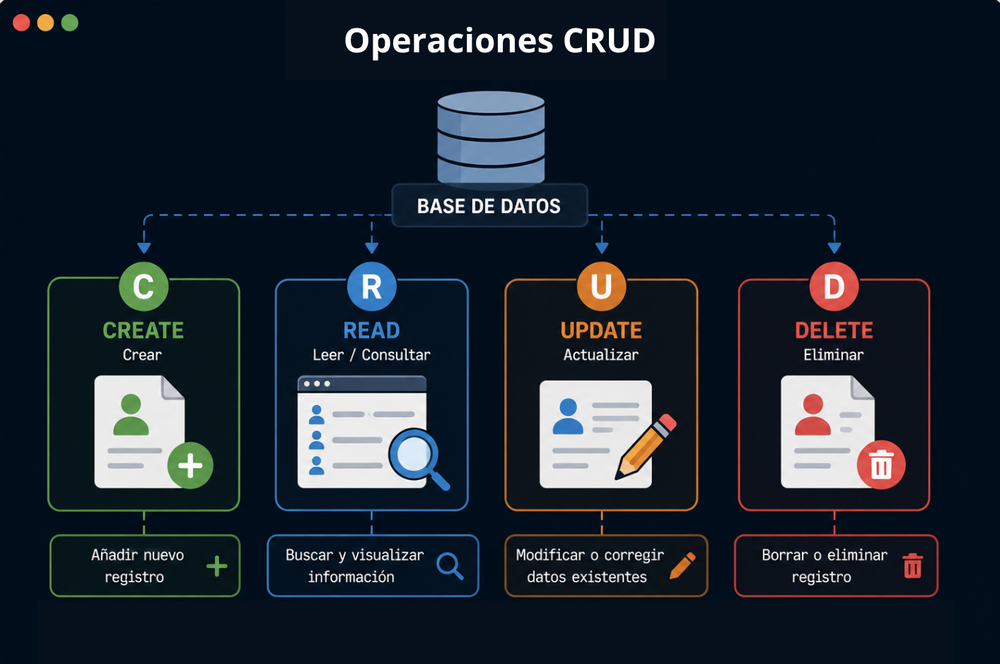
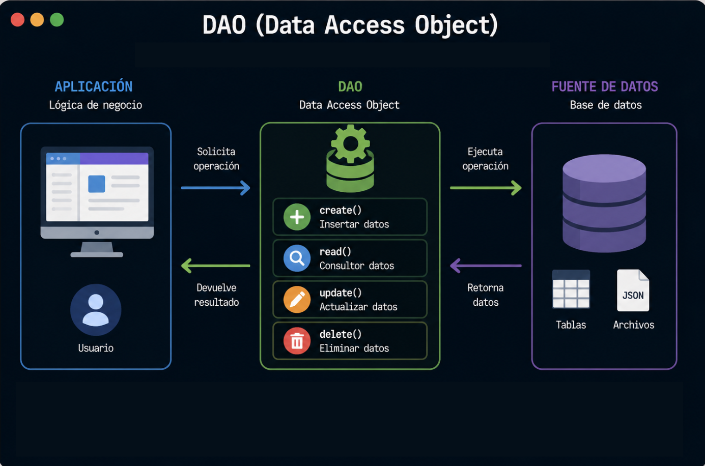

# Persistencia de Datos en Java

En este laboratorio, aprenderemos las operaciones fundamentales de manipulación de datos (CRUD) y cómo estructurar el código con el patrón de diseño DAO y conexion con base de datos.

---

## Tipos de Persistencia de Datos

Los tipos de persistencia se clasifican según la forma en que la información se almacena y se gestiona dentro de un sistema:

| Tipo de Persistencia | Formato de Almacenamiento |
| :--- | :--- |
| **Bases de Datos Relacionales** | Tablas estructuradas (filas y columnas) con relaciones definidas.|
| **Bases de Datos No Relacionales (NoSQL)** | Documentos flexibles de texto estructurado (JSON).|
| **Archivos Planos** | Archivos de texto locales almacenados directamente en el disco.|
| **Persistencia en la Nube** | Servidores remotos vía Internet. |

---

## Manipulación de Datos y Operaciones CRUD

Para interactuar con cualquier sistema de persistencia, utilizamos el acrónimo **CRUD**, que representa las cuatro acciones fundamentales:

---

## El Patrón de Diseño DAO (Data Access Object)

El patrón **DAO** es una técnica de arquitectura de software que permite **separar por completo la lógica de negocio de la lógica de acceso a datos**.

### Componentes de la Arquitectura DAO

Para implementar este patrón de manera ordenada, dividimos nuestro sistema en cuatro roles bien definidos:

---

## Ejercicio de Implementación:
