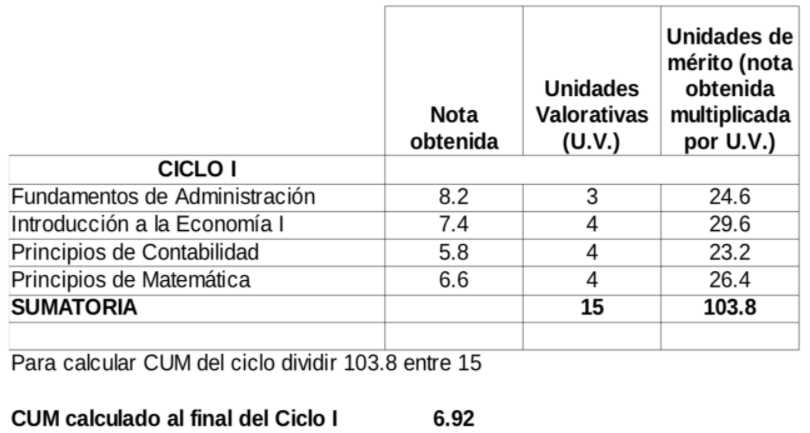
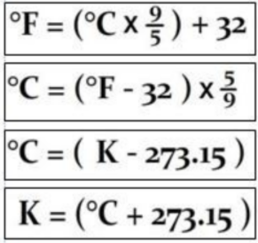

author: Marlene Aguilar
summary: Introduccion a c#
id: cp-1-poo
categories: c#
environments: Web
status: Draft


# Introducción a C#

## Introducción a C#
Duration: 0:15:00

### ¿Qué aprenderás?

- Sentencias de control de flujo
- Funciones
- Introducción a listas

### Sentencias de control de flujo

se refiere al orden en que se ejecutan las instrucciones o sentencias del programa (Joyanes, 2008). Existen dos tipos de estructura:
- Las estructuras condicionales 
- Las estructuras de bucles 

### Sintaxis del FOR
```csharp
for (int i = 0; i < 3; i++)
{
  Console.Write(i);
}
```

### Sintaxis del WHILE
```csharp
int n = 0;
while (n < 5)
{
  Console.Write(n);
  n++;
}
```

### Sintaxis del do-While
```csharp
int i = 0;
do
{
  Console.WriteLine("i = {0}", i);
  i++;
} while (i < 5);
```

## Practiquemos
Duration: 0:15:00

**Ejemplo: Calculo de CUM de ciclo**

Las unidades de mérito de una asignatura cursada se obtienen al multiplicar la calificación final de la asignatura por sus unidades valorativas. El CUM se obtiene al dividir el total de unidades de mérito obtenidas entre el total de las unidades valorativas de las asignaturas cursadas.

{width=512 height=512}


<aside class="positive">
  
  **La sintaxis varía un poco en C# respecto a C++** 

  - La sintaxis para la creación de arreglos:

  ```csharp
  char[ ] vocales1 = new char[5];
  string[ ] vocales2 = new string[5]{“a”,“e”,“i”,“o”,“u”};
  string[ ] vocales3 = new string[ ]{“a”,“e”,“i”,“o”,“u”};
  ```
> **foreach:** recorrer un arreglo o una lista.
</aside>

**Ejemplo**
> Solicitar al usuario una lista de nombres separados por coma, almacenar cada uno de ellos individualmente
> en una casilla de un arreglo. Finalmente mostrar cada nombre por separado.


## Funciones
Duration: 0:20:00

<aside class="positive">
En lenguajes de programación orientados a objetos, como C#, no se acostumbra utilizar el paradigma estructurado, aunque si es posible hacerlo.
</aside>

```csharp
public static void saludar() {
 Console.write("Hola!!!")
}
```
<aside class="negative">

Es posible ejecutar funciones desde el main sólo si se les antecede la palabra reservada **static**
</aside>

A diferencia de C++, en C# no se utilizan los prototipos de funciones. Las funciones pueden declararse en cualquier orden, antes o después del main.

```csharp
public static void Main(string[] args)
{
  saludar("POO");
  Console.ReadLine();
}
public static void saludar(string nombre) {
  Console.WriteLine("Hola "+ nombre);
}
```
**Ejemplo: Habitaciones de un hotel**

Implemente un programa que almacene la cantidad de habitaciones ocupadas actualmente y las despachadas de manera histórica para un pequeño hotel que tiene diez cuartos, cada uno vale $15.

Se deberá mostrar el siguiente menú:
1. Reservar habitaciones
2. Despachar habitaciones
3. Habitaciones ocupadas
4. Calcular ganancias
5. Salir

Finalmente genere un EXE para poder ejecutar su programa.

<aside class="positive">

**Sobrecarga**
Se refiere a la posibilidad de tener dos o m ́as funciones con el mismo nombre pero funcionalidad diferente. El compilador usará una u otra dependiendo de los parámetros usados. Las funciones deben contar con diferentes argumentos, caso contrario se generará un error.
</aside>

```csharp
public static int suma(int x, int y) {
  return x + y;
}
public static double suma(double a, double b) {
  return a + b;
}
public static double suma(double a, double b, double c) {
  return a + b + c;
}
```
## Introducción a listas
Duration: 0:15:00

En c# se utiliza la libreria Linq, para poder tener acceso las listas y utilizar los métodos requeridos. 

```csharp
List<int> lista = new List<int>();
lista.Add(1);
lista.Add(2);
lista.Insert(1, 5);

foreach (int numero in lista)
  Console.Write(numero + “ ”);

Console.WriteLine(lista.Max());
Console.WriteLine(lista.Sum());
lista.RemoveAt(1);
```

**Ejemplo: Conversor de temperatura**

Implemente un programa que almacene una cantidad din ́amica de temperaturas, originalmente en grados Celsius. El usuario podrá agregar o eliminar datos en cualquier momento. Se deberá mostrar el siguiente menú:

1. Agregar temperatura(Celcius)
2. Quitar temperatura (Celcius)
3. Mostrar temperatura máxima (Celcius)
4. Mostrar temperaturas en Celcius
5. Mostrar temperaturas en Fahrenheit
6. Mostrar temperaturas en Kelvin
7. Salir



